# EjerciciosSQL-BEECROWD 
--- 
## Nivel 3: 
--- 

### 17. CATEGORIES(Categorías) 
Cuando los datos fueron migrados a la base de datos, hubo un pequeño malentendido con el DBA. Tu jefe necesita que selecciones el ID y el nombre de los productos, cuya categoría comience con **"super"**. 
 
 
 

**Solución:**
 

**Explicación:** 
* *Se realiza un JOIN entre la tabla de productos y la de categorías, filtrando aquellas cuyo nombre empiece con “super”.* 
--- 

### 18. AVERAGE VALUE OF PRODUCTS (Valor promedio de los productos) 
En la empresa donde trabajas se está realizando una encuesta sobre los valores de los productos que se comercializan. Para ayudar a la industria que está realizando esta encuesta, debes calcular y mostrar el valor promedio del precio de los productos. 
**NOTA:** Muestra el valor con dos dígitos después del punto. 
 
 
 

**Solución:** 
 

**Explicación:** 
* *Se utiliza la función AVG para obtener el promedio y la función ROUND para redondear el resultado a dos decimales.* 
--- 

### 19. IMPORTED PRODUCTS (Productos Importados) 
El sector de importaciones de la empresa necesita un informe sobre la importación de productos de nuestros proveedores Sansul. Tu tarea es mostrar el nombre de los productos, el nombre del proveedor y el nombre de la categoría, para aquellos productos suministrados por el proveedor **'Sansul SA'** y cuya categoría sea **'Imported'**. 

 
 
 

**Solución:** 
 

**Explicación:** 
* *Se unen las tres tablas y se filtra tanto por el nombre del proveedor como por el de la categoría.* 
--- 
### 20. ORDERS IN FIRST HALF (Pedidos del primer semestre) 
La auditoría financiera de la empresa nos solicita un informe correspondiente a la primera mitad de 2016. Muestra el nombre del cliente y el número del pedido para los clientes que realizaron pedidos en la primera mitad de 2016. 
 
 
 

**Solución:** 
 

**Explicación:** 
* *Se utiliza la cláusula BETWEEN para filtrar las fechas correspondientes a la primera mitad del año.* 
---

### 21. AMOUNTS BETWEEN 10 AND 20 (Cantidades entre 10 y 20) 
Al entregar el informe sobre la cantidad de productos en stock de la empresa, una parte del informe se ha corrompido, por lo que el encargado de inventario pidió ayuda. Él quiere que muestres el nombre de los productos cuya cantidad se encuentre entre 10 y 20 y cuyo proveedor comience con la letra **'P'**. 
 
 
 

**Solución:** 
 

**Explicación:** 
* *Se filtra tanto por el patrón en el nombre del proveedor como por el rango de la cantidad del producto.* 
--- 

### 22. NUMBER OF CITIES PER CUSTOMERS (Número de ciudades por cliente) 
La junta directiva de la empresa te pidió un informe sencillo sobre cuántas ciudades ha alcanzado la empresa. Para ello, debes mostrar el número de ciudades distintas que aparecen en la tabla de clientes. 
 
 
 

**Solución:** 
 

**Explicación:** 
* *Se utiliza la función COUNT combinada con DISTINCT para contar únicamente las ciudades únicas.*
--- 

### 23. NUMBER OF CHARACTERS (Caracteres de Números)
La Organización Global de Caracteres en los Nombres de las Personas (GOCPN) realizó un censo para determinar cuántos caracteres tienen los nombres de las personas. Para ayudar a la GOCPN, debes mostrar el número de caracteres de cada nombre, ordenados de mayor a menor. 
 
 
 

**Solución:** 
 

**Explicación:** 
* *Se utiliza la función CHARACTER_LENGTH para obtener la longitud de cada nombre y se ordena el resultado de forma descendente.* 
--- 

### 24. TAXES (Impuestos)
Vas a la reunión internacional de impuestos personales y tu propuesta es: Todo individuo con ingresos superiores a 3000 debe pagar un impuesto al gobierno, que equivale al 10% de sus ingresos. Muestra el nombre y el valor del impuesto de cada persona que gana más de 3000, con dos decimales de precisión. 
 
 
 

**Solución:** 
 

**Explicación:** 
* *Se filtra por salario y se calcula el impuesto multiplicando el salario por 0.10, redondeando el resultado a dos decimales.* 
--- 

### 25. MOST FREQUENT (Más frecuentes)
Dada una tabla de una sola columna con valores enteros, ¿cuál es el valor más frecuente, es decir, la moda estadística de los valores? 
 
 
 

**Solución:** 
 

**Explicación:** 
* *Se agrupan los registros por la columna indicada y se cuenta la frecuencia de cada valor, devolviendo el que tiene mayor ocurrencia.* 
--- 

---
## Nivel 4:
---

### 26. BASIC SELECT (Seleccionar básico)
La empresa está realizando una encuesta sobre cuántos clientes están registrados en los estados; sin embargo, se omitieron los datos del estado de **'Rio Grande do Sul'**. 
Debes mostrar los nombres de todos los clientes cuyo estado sea **'RS'**. 
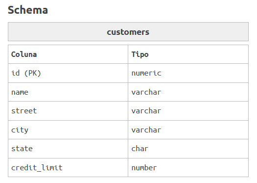 
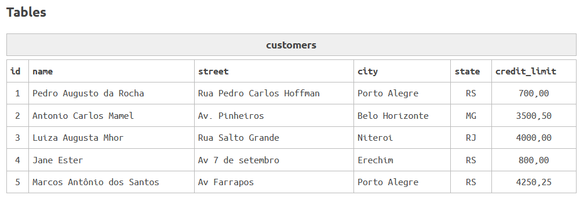 
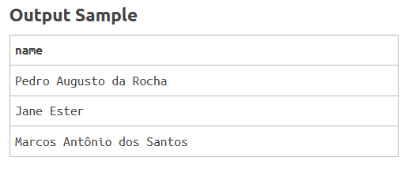 

**Solución:** 
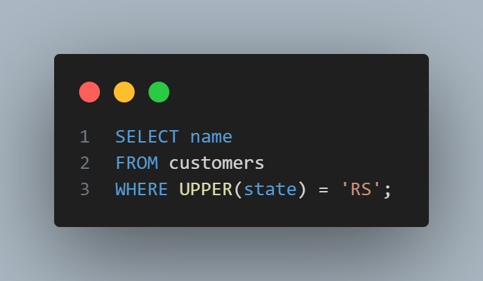 

**Explicación:** 
* *Se utiliza la función UPPER para comparar de forma insensible al caso el estado con el valor 'RS'.* 
---

### 27. EXECUTIVE REPRESENTATIVES (Representantes ejecutivos)
El sector financiero necesita un informe sobre los proveedores de los productos que vendemos. Los informes incluyen todas las categorías, pero por alguna razón, los proveedores de productos cuya categoría es ejecutiva no aparecen en el informe. Tu tarea es devolver los nombres de los productos y de los proveedores cuya categoría tenga el ID **6**. 
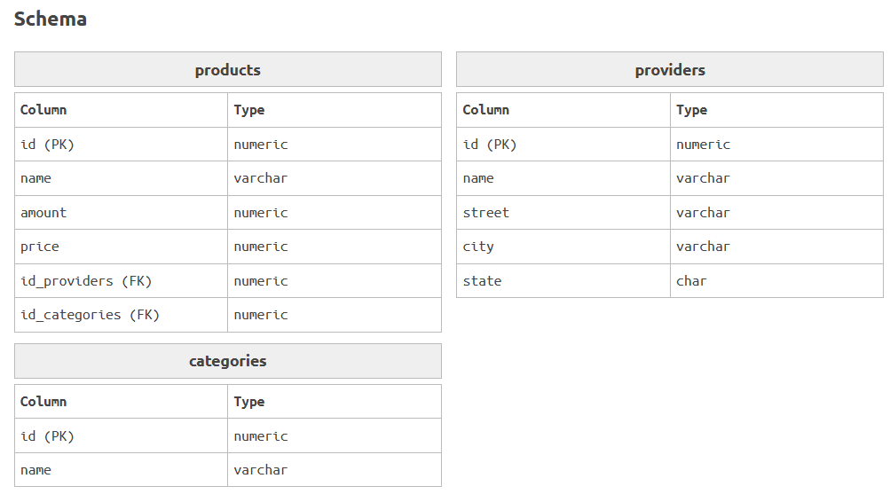 
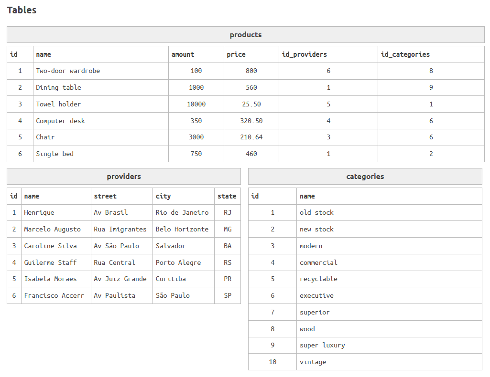 
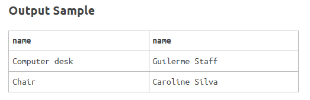 

**Solución:** 
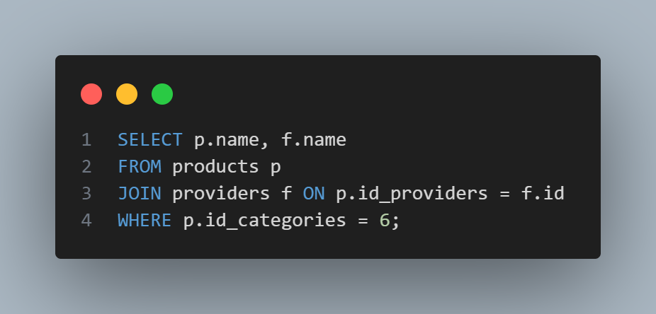 

**Explicación:** 
* *Se realiza un JOIN entre las tablas de productos y proveedores, filtrando aquellos productos cuya categoría es la indicada.* 
--- 

### 28. ACTION MOVIES (Películas de acción)
Una contratista de una videotienda fue contratada para catalogar sus películas. Necesitan que selecciones el código y el nombre de las películas cuya descripción del género sea **'Action'**. 
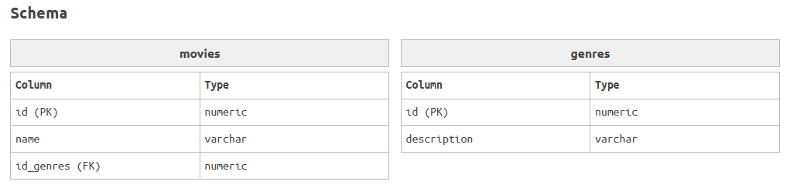 
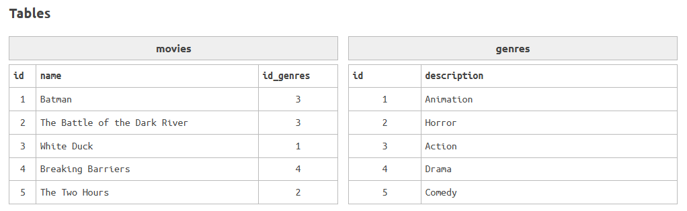 
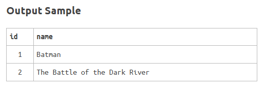 

**Solución:** 
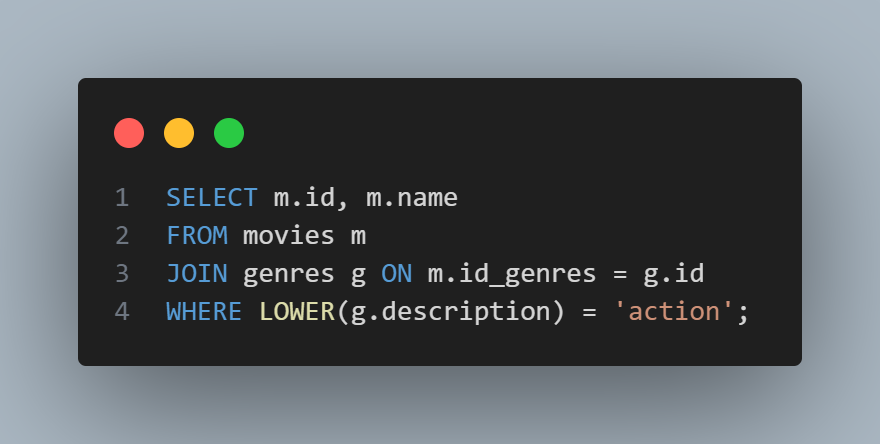 

**Explicación:** 
* *Recupera los valores de la columna city de la tabla providers.* 
--- 

### 29. CATEGORIES WITH VARIOUS PRODUCTS (Categorías con varios productos)
La industria de ventas necesita un informe para conocer qué productos quedan en stock. Para ayudar a la industria de ventas, muestra el nombre del producto y el nombre de la categoría para aquellos productos cuya cantidad sea mayor a 100 y cuyo ID de categoría sea **1, 2, 3, 6 o 9**. 
Muestra los resultados en orden ascendente por ID de categoría. 
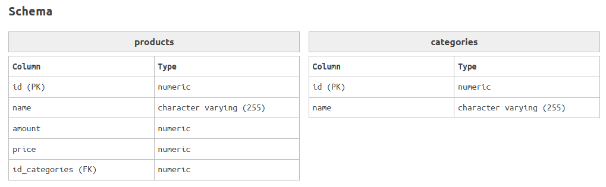 
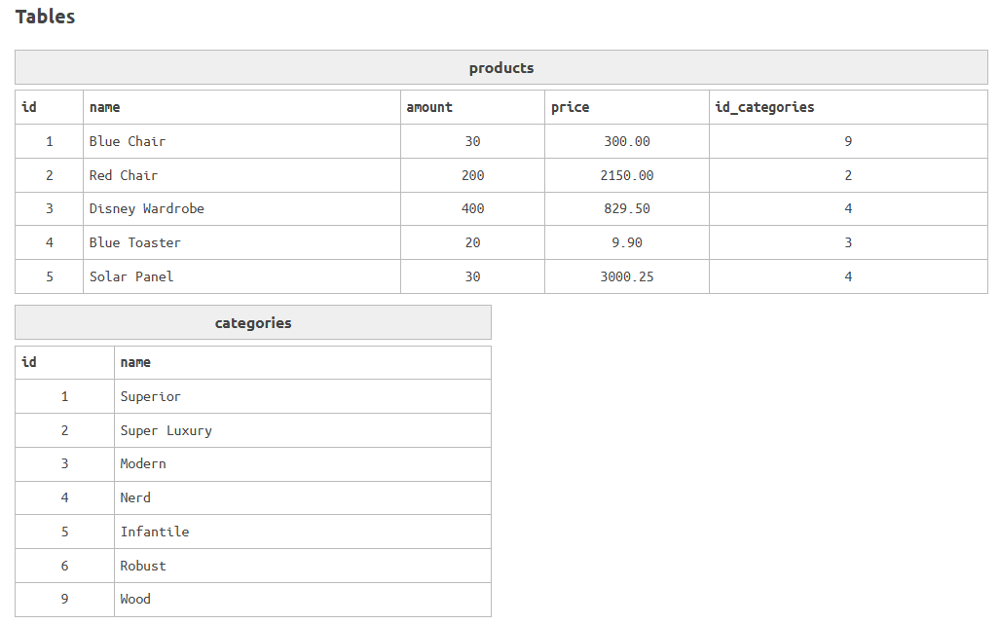 
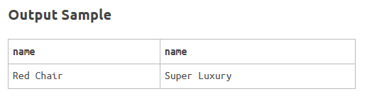 

**Solución:**
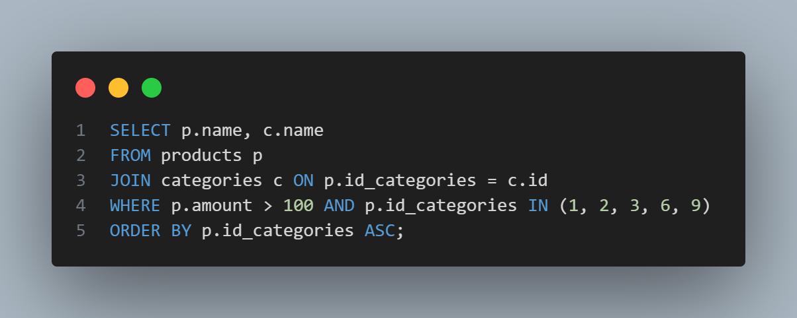 

**Explicación:** 
* *Se filtran los productos con cantidad mayor a 100 y se limita la búsqueda a las categorías indicadas, ordenando el resultado por el ID de la categoría de forma ascendente.* 
--- 

### 30. CPF VALIDATION (Validación del CPF)
Los gerentes de comunicaciones de la empresa desean un informe sobre los datos de clientes personas naturales que están registrados en la base de datos. Pero el informe antiguo tenía un problema: los datos del CPF de los clientes venían sin validación. Tu tarea ahora es seleccionar todos los CPFs de todos los clientes y aplicar una máscara al mostrar los datos. La máscara para el CPF es: **'000.000.000-00'**. 
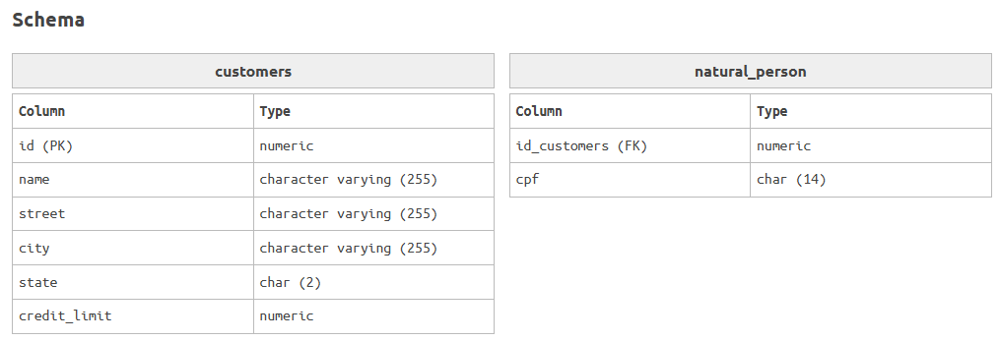 
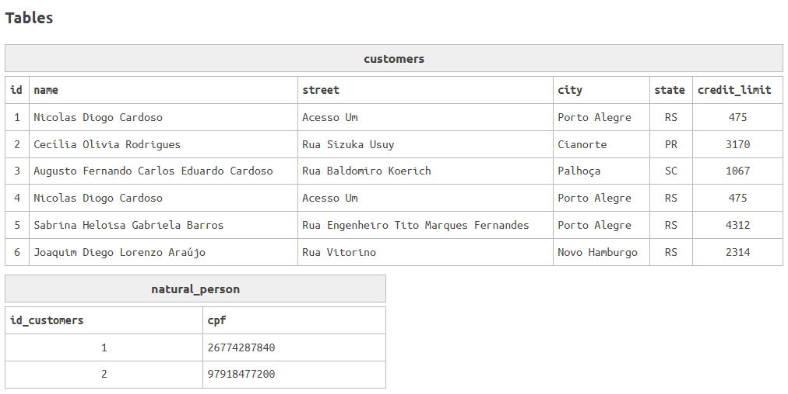 
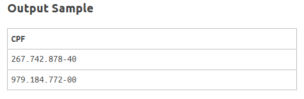 

**Solución:**
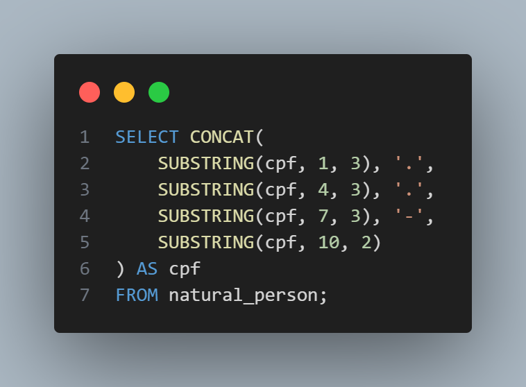 

**Explicación:** 
* *Se utilizan las funciones SUBSTRING y CONCAT para extraer y unir las partes del CPF aplicando la máscara requerida.* 
--- 

### 31. CONTEST (Concurso)
La Universidad de Tecnología de Marte tiene plazas abiertas para investigadores. Sin embargo, la computadora responsable de procesar los datos de los candidatos está rota. Debes presentar la lista de candidatos, que contenga el nombre y la puntuación final (con dos decimales de precisión) de cada candidato. Recuerda mostrar la lista ordenada por puntuación (de mayor a menor). La puntuación se calcula mediante la media ponderada descrita como: 
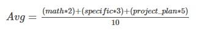 
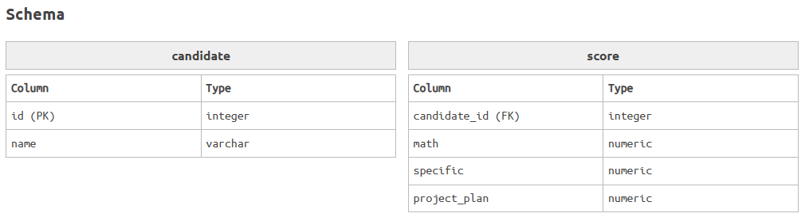 
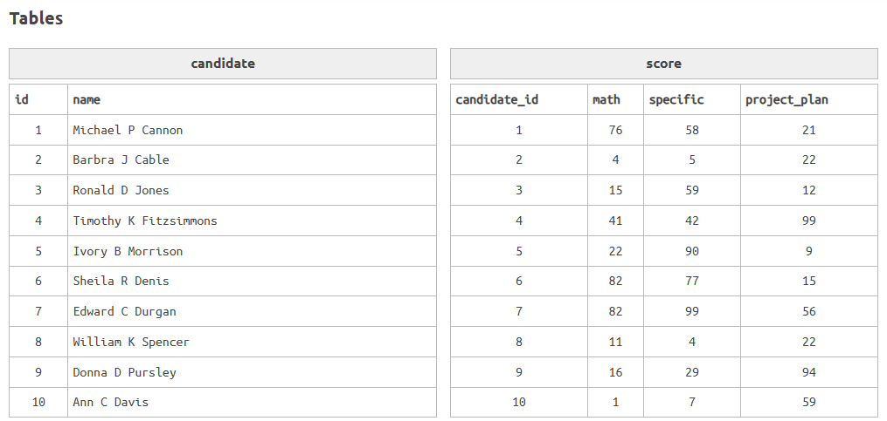 
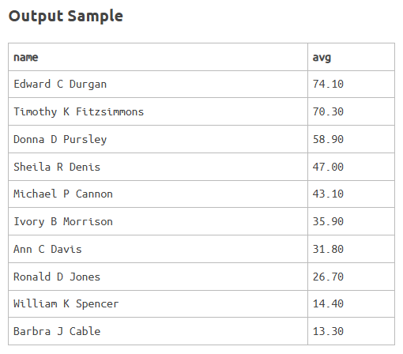 

**Solución:** 
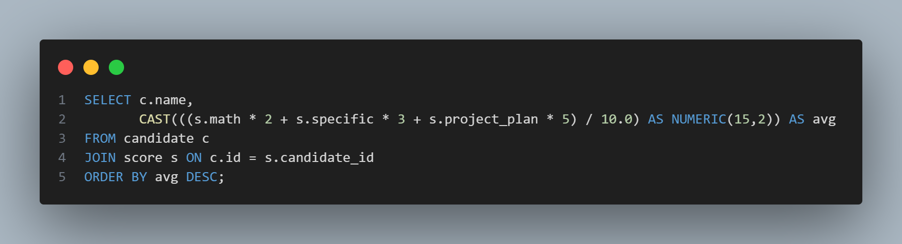 

**Explicación:** 
* *Se calcula la media ponderada multiplicando cada puntuación por su respectiva ponderación, dividiendo entre 10 y ordenando los resultados de mayor a menor.* 
--- 

### 32. CEARENSE CHAMPIONSHIP (Campeonato Cearense)
El Campeonato Cearense de Fútbol atrae a miles de aficionados cada año y trabajas para un periódico, estando a cargo de calcular la tabla de posiciones. Muestra una tabla con las siguientes columnas: nombre del equipo, número de partidos, victorias, derrotas, empates y puntos. Sabiendo que la puntuación se calcula asignando 3 puntos por victoria, 1 punto por empate y 0 puntos por derrota, muestra la tabla ordenada de mayor a menor puntuación. 
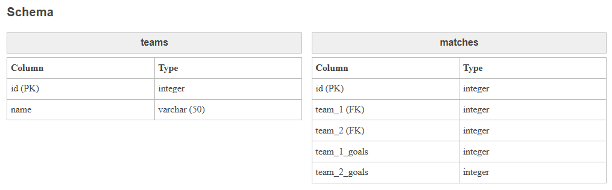 
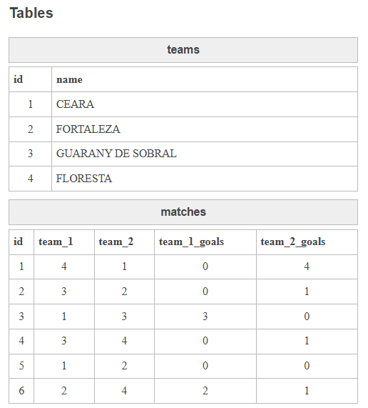 
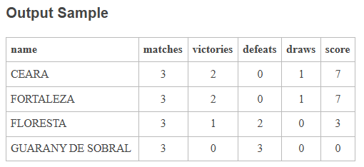 

**Solución:** 
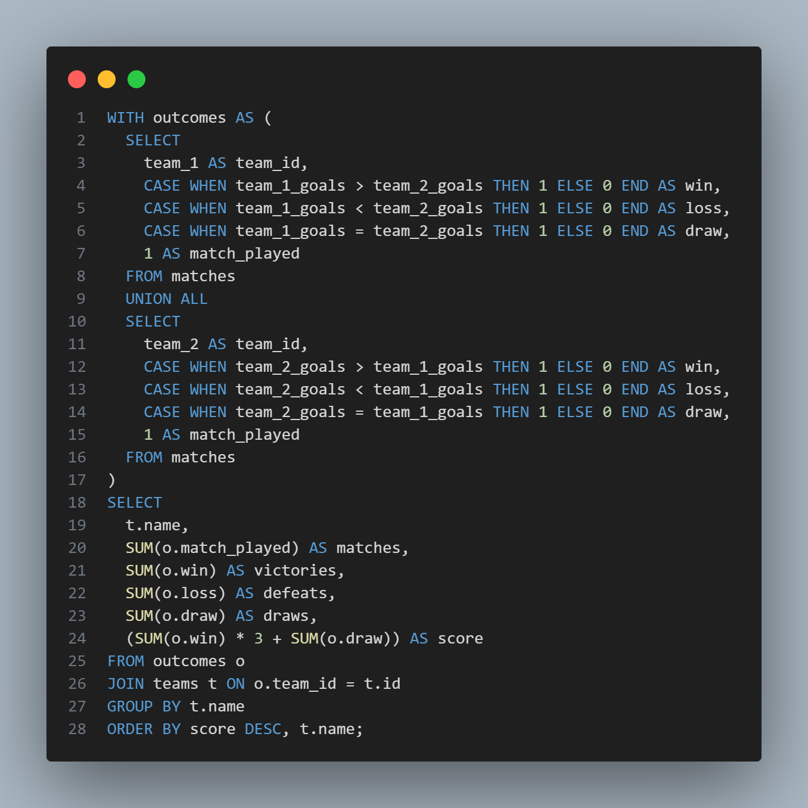 

**Explicación:** 
* *La CTE `outcomes` extrae, por cada partido, el resultado (victoria, derrota o empate) para cada equipo, independientemente de si aparece en la columna `team_1` o `team_2`.* 
* *Luego, se agrupa por el nombre del equipo (uniéndolo con la tabla `teams`) y se suman los partidos, victorias, derrotas y empates.* 
* *El puntaje se calcula como 3 puntos por victoria y 1 por empate.* 
* *Finalmente se ordena de mayor a menor puntaje (y en caso de empate, por nombre).* 
--- 

### 33. EMPLOYEES CPF (CPF de Empleados)
Muestra el CPF, el nombre de los empleados y el nombre del departamento de aquellos empleados que no trabajan en ningún proyecto. El resultado debe estar ordenado por CPF. 
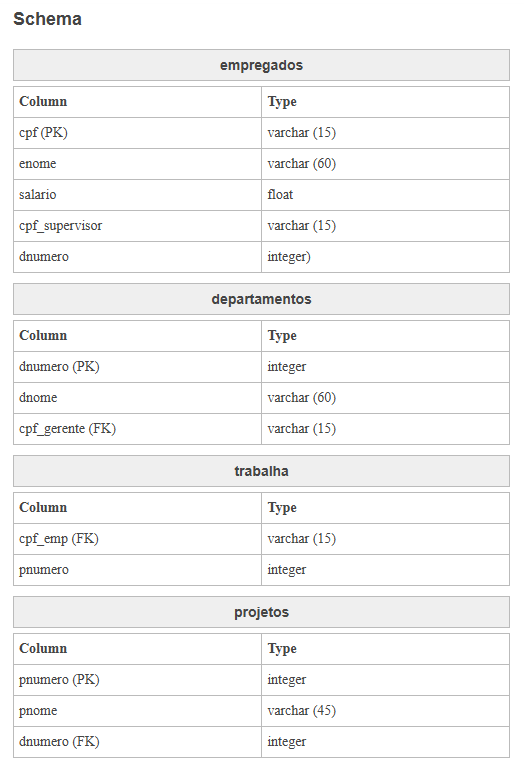 
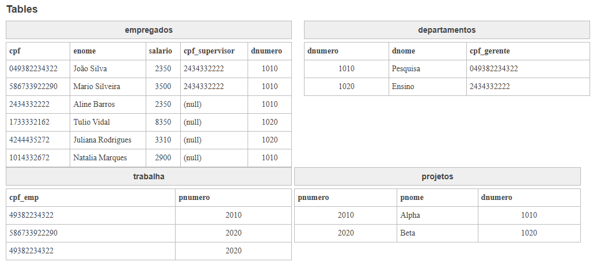 
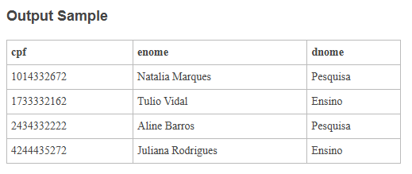 

**Solución:** 
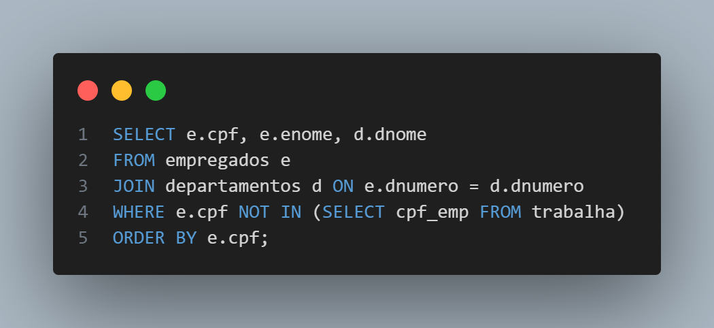 

**Explicación:** 
* *1. Se une la tabla **empregados** con **departamentos** usando la columna *dnumero* para obtener el nombre del departamento.* 
* *2. Se filtran los empleados cuyo CPF **no aparece** en la tabla *trabalha* (esto indica que no están asignados a ningún proyecto).*
*  *3. Se ordena el resultado por CPF.* 
---