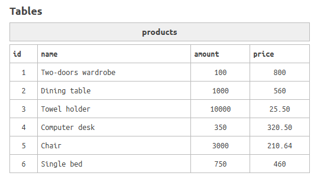

# EjerciciosSQL-BEECROWD 
--- 
## Nivel 3: 
--- 

### 17. CATEGORIES(Categorías) 
Cuando los datos fueron migrados a la base de datos, hubo un pequeño malentendido con el DBA. Tu jefe necesita que selecciones el ID y el nombre de los productos, cuya categoría comience con **"super"**. 
 
 
 

**Solución:**
 

**Explicación:** 
* *Se realiza un JOIN entre la tabla de productos y la de categorías, filtrando aquellas cuyo nombre empiece con “super”.* 
--- 

### 18. AVERAGE VALUE OF PRODUCTS (Valor promedio de los productos) 
En la empresa donde trabajas se está realizando una encuesta sobre los valores de los productos que se comercializan. Para ayudar a la industria que está realizando esta encuesta, debes calcular y mostrar el valor promedio del precio de los productos. 
**NOTA:** Muestra el valor con dos dígitos después del punto. 
 
 
 

**Solución:** 
 

**Explicación:** 
* *Se utiliza la función AVG para obtener el promedio y la función ROUND para redondear el resultado a dos decimales.* 
--- 

### 19. IMPORTED PRODUCTS (Productos Importados) 
El sector de importaciones de la empresa necesita un informe sobre la importación de productos de nuestros proveedores Sansul. Tu tarea es mostrar el nombre de los productos, el nombre del proveedor y el nombre de la categoría, para aquellos productos suministrados por el proveedor **'Sansul SA'** y cuya categoría sea **'Imported'**. 

 
 
 

**Solución:** 
 

**Explicación:** 
* *Se unen las tres tablas y se filtra tanto por el nombre del proveedor como por el de la categoría.* 
--- 
### 20. ORDERS IN FIRST HALF (Pedidos del primer semestre) 
La auditoría financiera de la empresa nos solicita un informe correspondiente a la primera mitad de 2016. Muestra el nombre del cliente y el número del pedido para los clientes que realizaron pedidos en la primera mitad de 2016. 
 
 
 

**Solución:** 
 

**Explicación:** 
* *Se utiliza la cláusula BETWEEN para filtrar las fechas correspondientes a la primera mitad del año.* 
---

### 21. AMOUNTS BETWEEN 10 AND 20 (Cantidades entre 10 y 20) 
Al entregar el informe sobre la cantidad de productos en stock de la empresa, una parte del informe se ha corrompido, por lo que el encargado de inventario pidió ayuda. Él quiere que muestres el nombre de los productos cuya cantidad se encuentre entre 10 y 20 y cuyo proveedor comience con la letra **'P'**. 
 
 
 

**Solución:** 
 

**Explicación:** 
* *Se filtra tanto por el patrón en el nombre del proveedor como por el rango de la cantidad del producto.* 
--- 

### 22. NUMBER OF CITIES PER CUSTOMERS (Número de ciudades por cliente) 
La junta directiva de la empresa te pidió un informe sencillo sobre cuántas ciudades ha alcanzado la empresa. Para ello, debes mostrar el número de ciudades distintas que aparecen en la tabla de clientes. 
 
 
 

**Solución:** 
 

**Explicación:** 
* *Se utiliza la función COUNT combinada con DISTINCT para contar únicamente las ciudades únicas.*
--- 

### 23. NUMBER OF CHARACTERS (Caracteres de Números)
La Organización Global de Caracteres en los Nombres de las Personas (GOCPN) realizó un censo para determinar cuántos caracteres tienen los nombres de las personas. Para ayudar a la GOCPN, debes mostrar el número de caracteres de cada nombre, ordenados de mayor a menor. 
 
 
 

**Solución:** 
 

**Explicación:** 
* *Se utiliza la función CHARACTER_LENGTH para obtener la longitud de cada nombre y se ordena el resultado de forma descendente.* 
--- 

### 24. TAXES (Impuestos)
Vas a la reunión internacional de impuestos personales y tu propuesta es: Todo individuo con ingresos superiores a 3000 debe pagar un impuesto al gobierno, que equivale al 10% de sus ingresos. Muestra el nombre y el valor del impuesto de cada persona que gana más de 3000, con dos decimales de precisión. 
 
 
 

**Solución:** 
 

**Explicación:** 
* *Se filtra por salario y se calcula el impuesto multiplicando el salario por 0.10, redondeando el resultado a dos decimales.* 
--- 

### 25. MOST FREQUENT (Más frecuentes)
Dada una tabla de una sola columna con valores enteros, ¿cuál es el valor más frecuente, es decir, la moda estadística de los valores? 
 
 
 

**Solución:** 
 

**Explicación:** 
* *Se agrupan los registros por la columna indicada y se cuenta la frecuencia de cada valor, devolviendo el que tiene mayor ocurrencia.* 
--- 
