# EjerciciosSQL-BEECROWD 
--- 
## Nivel 5: 
--- 

### 34. SEPTEMBER RENTALS(Alquileres de Septiembre) 
El videoclub está preparando su informe semestral y necesita tu ayuda. Solo tienes que seleccionar el nombre de los clientes y la fecha de alquiler, de entre los alquileres realizados en septiembre de 2016.
 
 
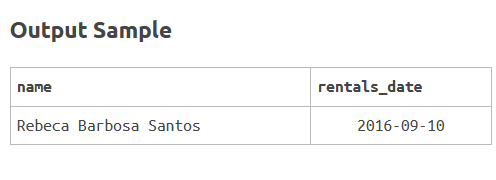 

**Solución:**
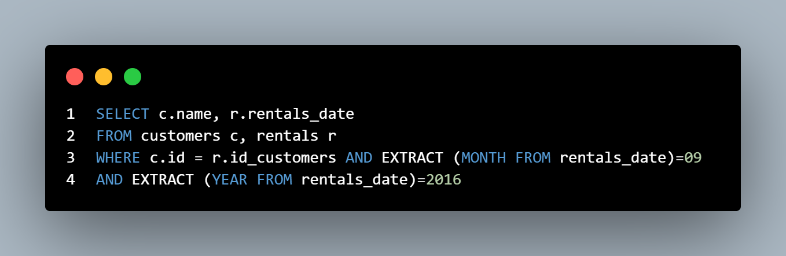 

**Explicación:** 
* *Se realiza una unión (JOIN) entre las tablas customers y rentals utilizando la clave foránea id_customers.*

*Se filtran las filas cuya fecha de alquiler (rentals_date) esté entre el 1 y el 30 de septiembre de 2016, inclusive.

*Es importante asegurarse de que las fechas estén en el formato YYYY-MM-DD para evitar errores de formato de fecha.* 
---

### 35. NO RENTAL(Sin Alquiler) 
El videoclub planea realizar una promoción para clientes que aún no han alquilado.
Su tarea es proporcionarnos el ID y el nombre de los clientes que aún no han alquilado. Ordene la salida por ID.
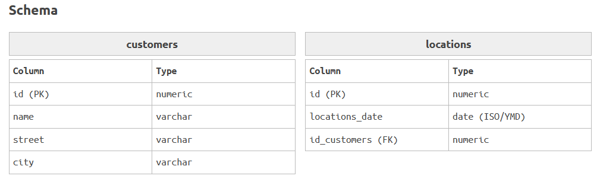 
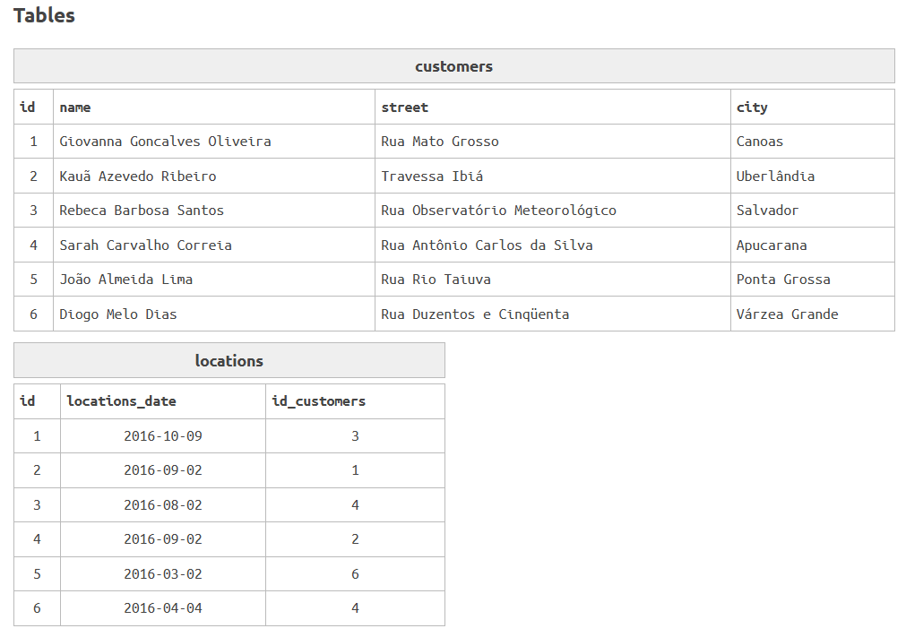 
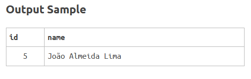 

**Solución:**
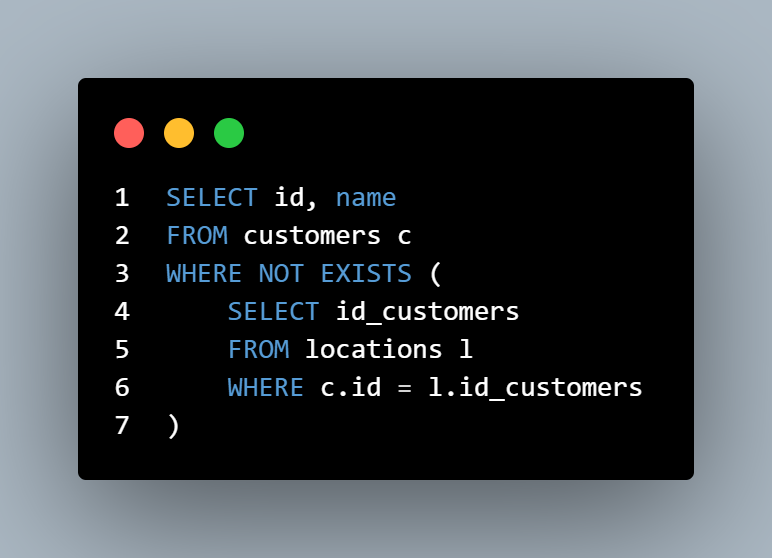 

**Explicación:** 
* *Se seleccionan los clientes que no tienen registros en la tabla de ubicaciones, utilizando una subconsulta con NOT EXISTS.* 
---

### 36. LEAGUE(Liga) 
La Liga Internacional de Excavaciones Subterráneas es un éxito entre los deportes alternativos. Sin embargo, el personal encargado de organizar los eventos no entiende nada de informática; solo saben excavar y las reglas del deporte. Por ello, te contrataron para resolver el problema de la Liga.
Selecciona a los tres primeros clasificados con la frase inicial "Podio:" y selecciona a los dos últimos, que descenderán a una liga inferior con la frase inicial "Degradado:".
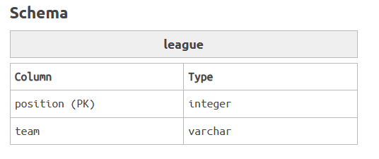 
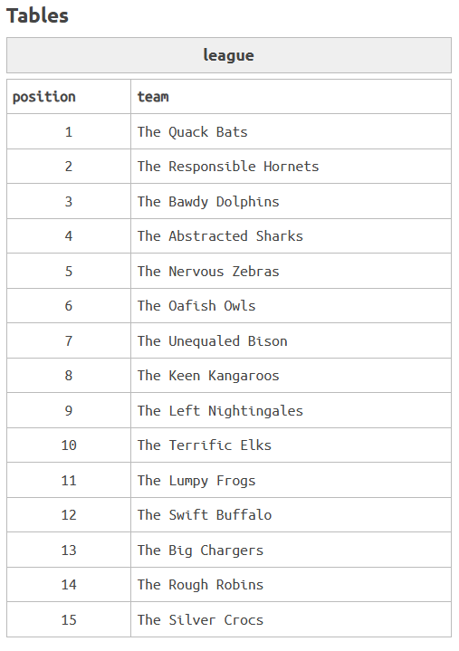 
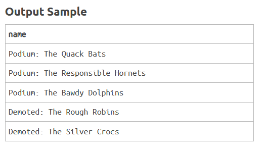 

**Solución:**
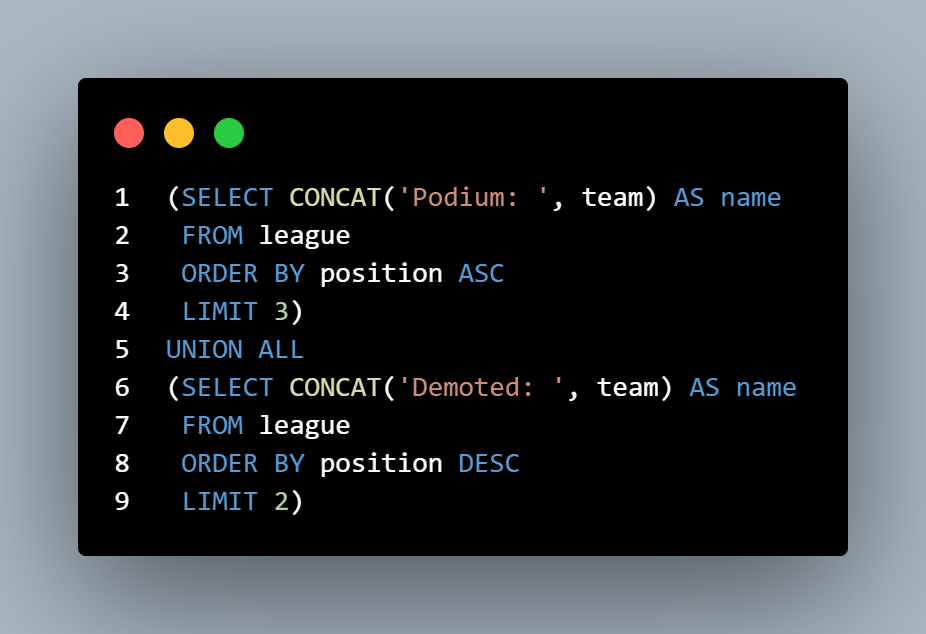 

**Explicación:** 
* *Se combinan dos consultas: una para los tres primeros lugares y otra para los dos últimos, utilizando UNION ALL y CONCAT para formatear los nombres.* 
---

### 37. STUDENTS GRADES(Calificaciones de los estudiantes) 
El semestre terminó en la Universidad de Transilvania del Sur. Se cerraron todos los grados, y solo Alquimia 104 no ha publicado su lista de estudiantes aprobados.
Por lo tanto, debe mostrar la palabra "Aprobado:" junto al nombre del estudiante y la calificación para aquellos aprobados (calificación ≥7).
Recuerde ordenar la lista por grado (primero las calificaciones más altas).
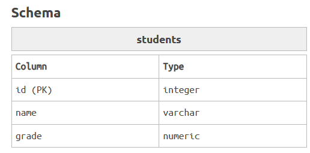 
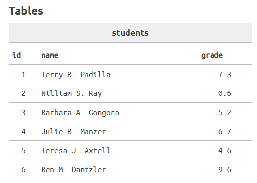 
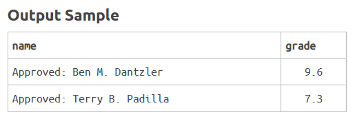 

**Solución:**
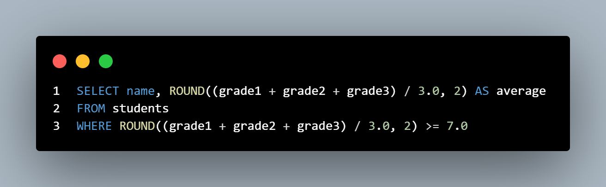 

**Explicación:** 
* *Se calculan las notas promedio de los estudiantes y se filtran aquellos con promedio mayor o igual a 7.0.* 
---

