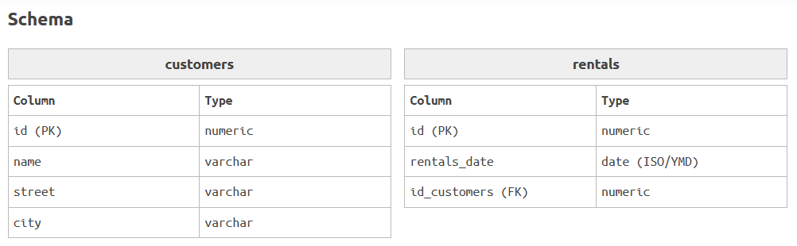

# EjerciciosSQL-BEECROWD 
--- 
## Nivel 5: 
--- 

### 34. SEPTEMBER RENTALS(Alquileres de Septiembre) 
El videoclub está preparando su informe semestral y necesita tu ayuda. Solo tienes que seleccionar el nombre de los clientes y la fecha de alquiler, de entre los alquileres realizados en septiembre de 2016.
 
 
 

**Solución:**
 

**Explicación:** 
* *Se realiza una unión (JOIN) entre las tablas customers y rentals utilizando la clave foránea id_customers.*

*Se filtran las filas cuya fecha de alquiler (rentals_date) esté entre el 1 y el 30 de septiembre de 2016, inclusive.

*Es importante asegurarse de que las fechas estén en el formato YYYY-MM-DD para evitar errores de formato de fecha.* 
---

### 35. NO RENTAL(Sin Alquiler) 
El videoclub planea realizar una promoción para clientes que aún no han alquilado.
Su tarea es proporcionarnos el ID y el nombre de los clientes que aún no han alquilado. Ordene la salida por ID.
 
 
 

**Solución:**
 

**Explicación:** 
* *Se seleccionan los clientes que no tienen registros en la tabla de ubicaciones, utilizando una subconsulta con NOT EXISTS.* 
---

