# EjerciciosSQL-BEECROWD
### Nivel 1:
## 1. CUSTOMER ADDRESS (Dirección de clientes)
La empresa organizará un evento para celebrar el 20.º aniversario del mercado, y para ello, organizaremos una gran celebración en Porto Alegre. También invitamos a todos nuestros clientes registrados en esta ciudad.
Su tarea consiste en obtener los nombres y direcciones de los clientes residentes en Porto Alegre para entregarles las invitaciones personalmente.
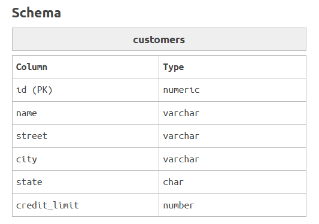
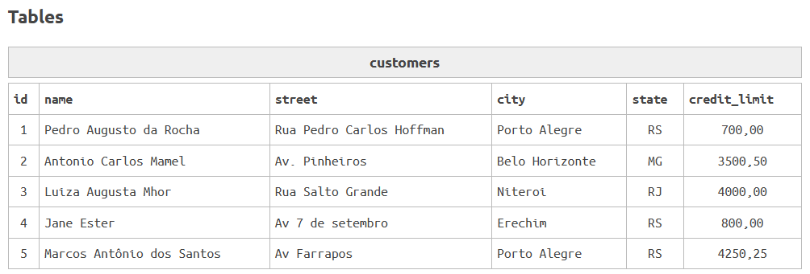
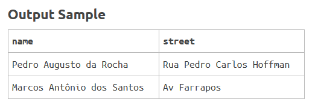

### Solución:
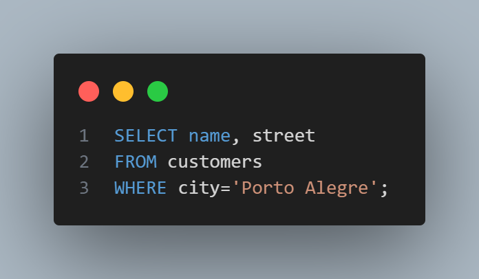

### Explicación:
* *Se seleccionan las columnas name y street de la tabla customers.*
* *Se extraen aquellos clientes que tengan 'Porto Alegre' en la columna city (ciudad).*

---

## 2. PROVIDERS' CITY IN ALPHABETICAL ORDER (Ciudad de los proveedores en orden alfabético)
La empresa solicita mensualmente un informe de las ciudades donde los proveedores están registrados. Por lo tanto, realice una consulta que devuelva todas las ciudades de los proveedores, pero en orden alfabético.
NOTA: No debe mostrar ciudades repetidas.
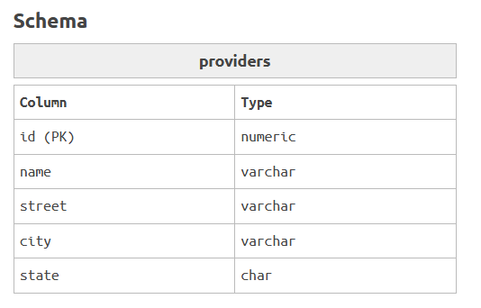
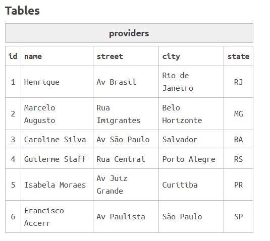
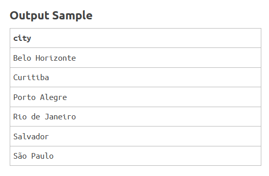

### Solución:
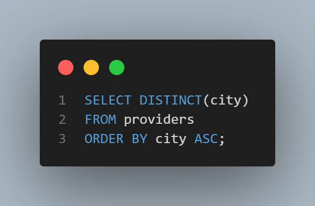

### Explicación:
* *Recupera los valores de la columna city de la tabla providers.*
* *DISTINCT elimina los duplicados, es decir, si hay varias filas con la misma ciudad, solo se mostrará una vez.*
* *ORDER BY, Ordena los resultados de la consulta en orden (ASC) ascendente (A-Z) según el nombre de la ciudad.*

---


## 3. HIGHER AND LOWER PRICE (Precios más altos y más bajos)
El sector financiero de nuestra empresa desea conocer los precios más altos y más bajos de los productos que vendemos.
Para ello, debe mostrar únicamente los precios más altos y más bajos de la tabla de productos.


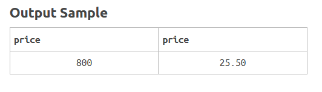

### Solución:
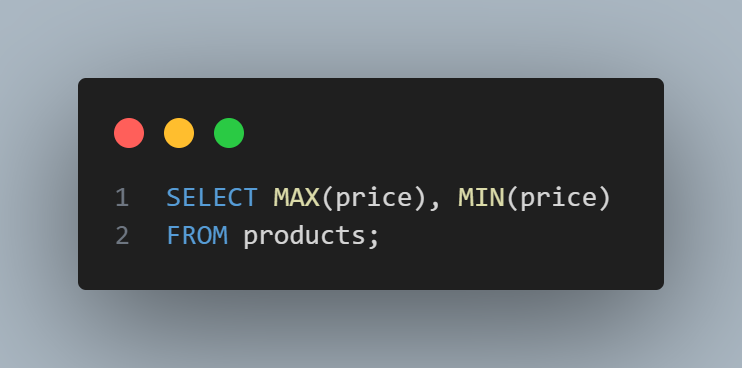

### Explicación: 
* *MAX y MIN, obtienen el precio más alto y más bajo(price) de la tabla products.*

---


## 4. EXPANDING THE BUSINESS (Expansión del Negocio)
La empresa de videoclub tiene como objetivo crear varias franquicias en todo Brasil. Para ello, necesitamos saber en qué ciudades viven nuestros clientes.
Para que nos ayude a seleccionar el nombre de todas las ciudades donde la empresa de alquiler tiene clientes. Por favor, no repita el nombre de la ciudad.

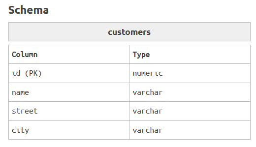
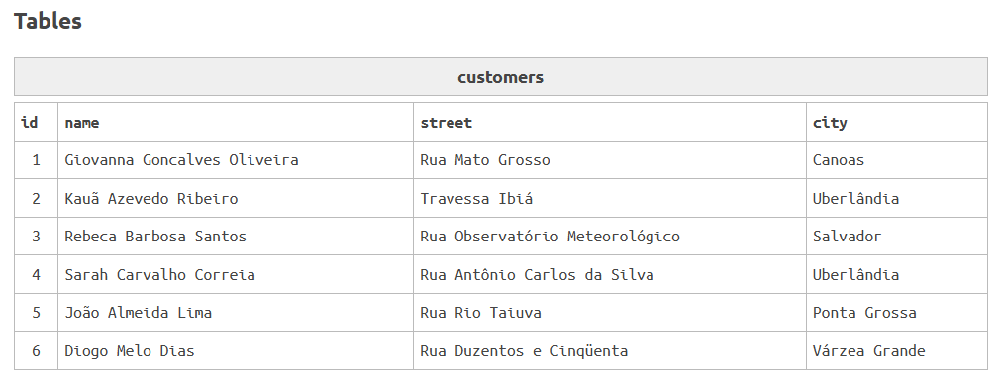
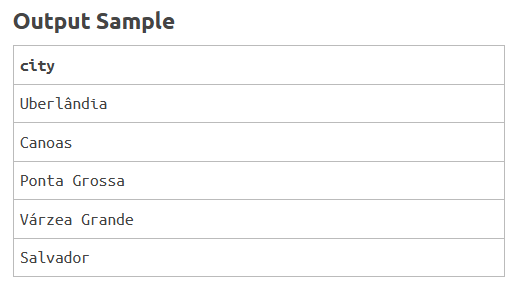

### Solución:
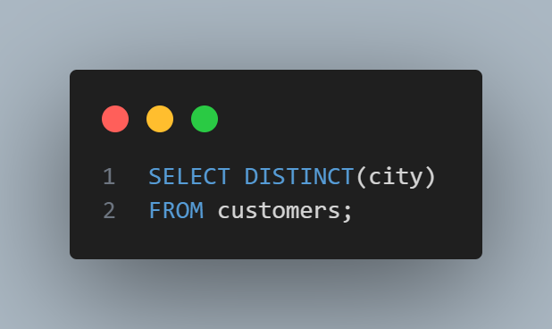

### Explicación:
* *Selecciona las ciudades solo una vez de la tabla customers.*
---


## 5. PROVIDER AJAX SA (Proveedor Ajax SA)
El sector financiero ha tenido problemas con la entrega de uno de nuestros proveedores. La entrega de los productos no coincide con la factura.
Su tarea es mostrar el nombre de los productos y el nombre del proveedor de los productos suministrados por Ajax SA.

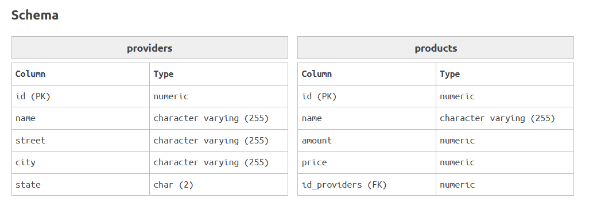
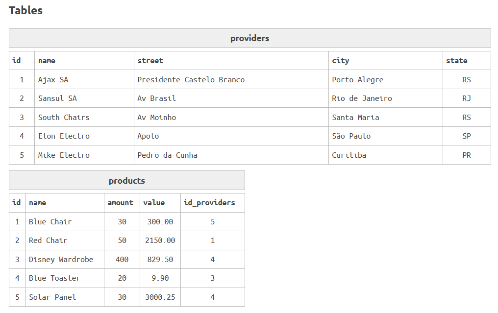
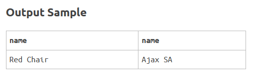

### Solución:
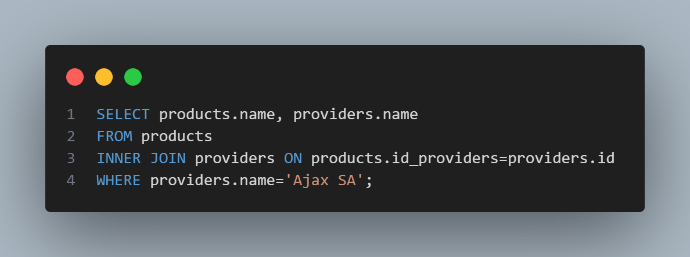

### Explicación:
```sql
SELECT products.name, providers.name
FROM products
```
* *Selecciona los nombres de los productos y los nombres de los proveedores, de la tabla productos*
```sql
INNER JOIN providers ON products.id_providers=providers.id
```
* *Une la tabla products con la tabla providers mediante la clave foránea id_providers en products y la clave primaria id en providers.*
```sql
WHERE providers.name='Ajax SA';
```
* *Filtra los resultados para que solo se muestren los productos cuyos proveedores tengan el nombre 'Ajax SA'.*

---


## 6. LEGAL PERSON (Persona Jurídica) 
El sector de ventas desea realizar una promoción para todos los clientes que sean personas jurídicas. Para ello, debe mostrar el nombre de los clientes que sean personas jurídicas.

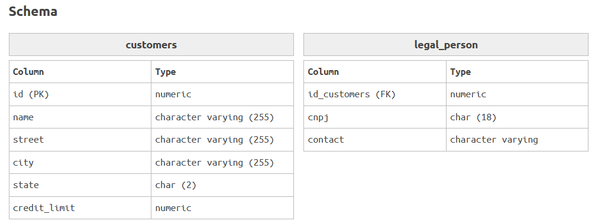
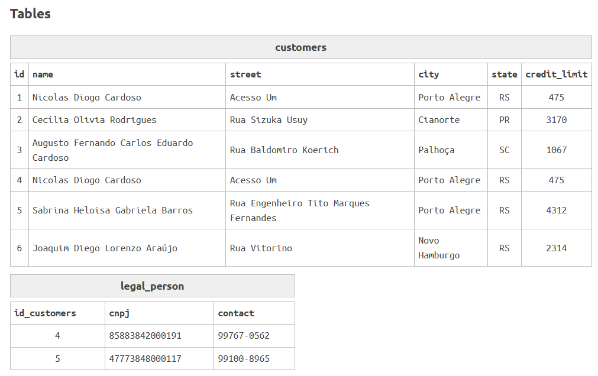
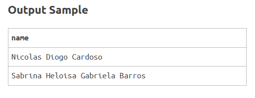

### Solución:
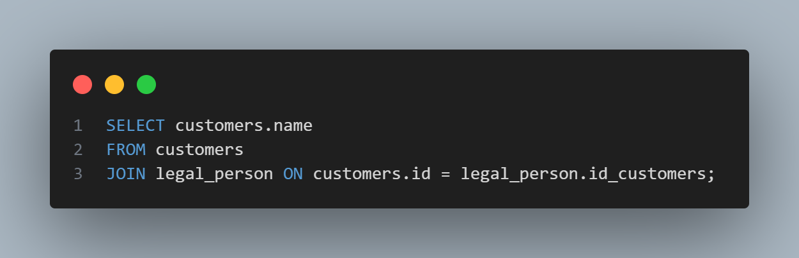

### Explicación: 
```sql
SELECT customers.name
FROM customers
```
* *Se selecciona la columna name de la tabla customers.*

```sql
JOIN legal_person
```
* *En este caso, se está combinando la tabla customers con la tabla legal_person.*
```sql
ON customers.id = legal_person.id_customers
```
* *Aquí se compara la columna id de la tabla customers para que coincida con la columna id_customers de la tabla legal_person.*

---


## 7. PASSWORDS (Contraseñas)
Te contrataron como consultor para una empresa. Al analizar la base de datos, observaste que las contraseñas se almacenan como archivos de texto y, como todos saben, esto es una práctica de seguridad pésima, ya que no están cifradas.
Por lo tanto, debes convertir todas las contraseñas al formato MD5. Muestra el ID del cliente, la contraseña antes de la conversión y el nuevo MD5.

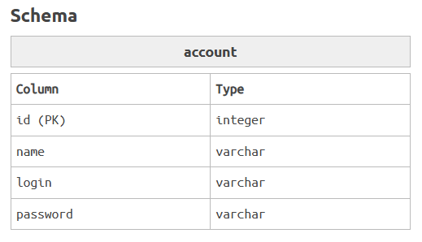
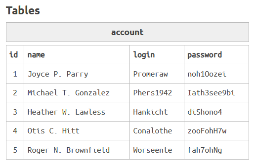
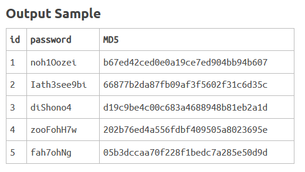

### Solución:
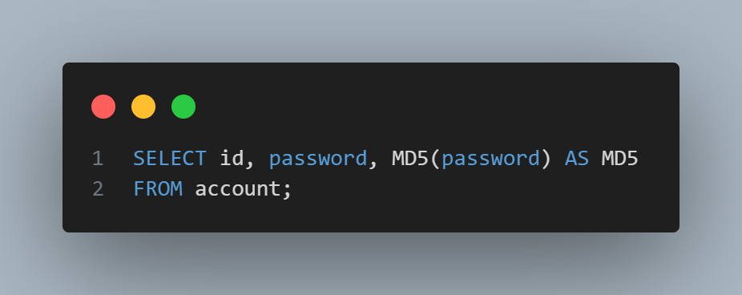

### Explicación: 
```sql
SELECT id, password, MD5(password) AS MD5
```
* *Se selecciona el id y el password directamente desde la tabla.*
* *MD5(password) genera el hash MD5 de la contraseña.*
* *Se usa AS MD5 para nombrar la columna resultante como "MD5".*
```sql
FROM account
```
* *Se extraen los datos de la tabla account.*

---
