# EjerciciosSQL-BEECROWD
---
## Nivel 1:
---
### 1. CUSTOMER ADDRESS (Dirección de clientes)
La empresa organizará un evento para celebrar el 20.º aniversario del mercado, y para ello, organizaremos una gran celebración en Porto Alegre. También invitamos a todos nuestros clientes registrados en esta ciudad.
Su tarea consiste en obtener los nombres y direcciones de los clientes residentes en Porto Alegre para entregarles las invitaciones personalmente.
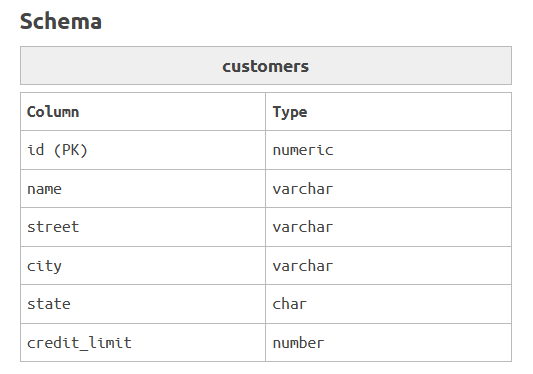
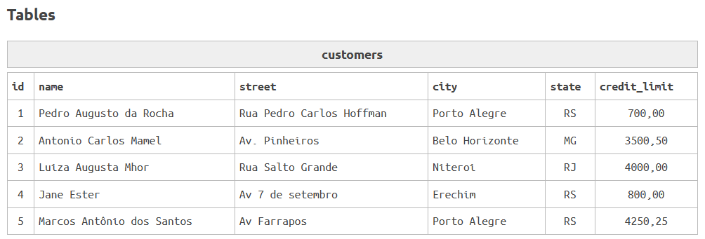
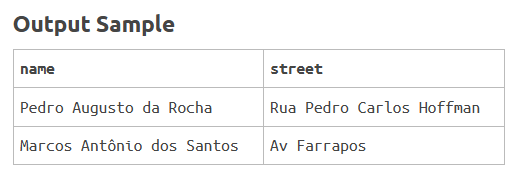

**Solución:**
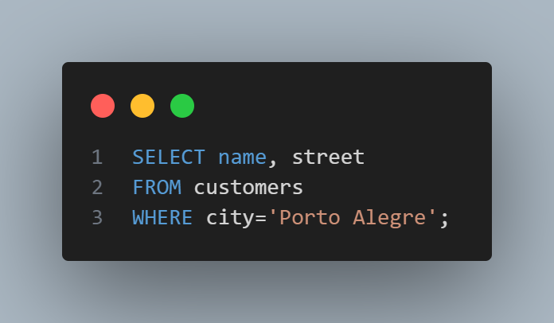

**Explicación:**
* *Se seleccionan las columnas name y street de la tabla customers.*
* *Se extraen aquellos clientes que tengan 'Porto Alegre' en la columna city (ciudad).*

---

### 2. PROVIDERS' CITY IN ALPHABETICAL ORDER (Ciudad de los proveedores en orden alfabético)
La empresa solicita mensualmente un informe de las ciudades donde los proveedores están registrados. Por lo tanto, realice una consulta que devuelva todas las ciudades de los proveedores, pero en orden alfabético.
**NOTA:** No debe mostrar ciudades repetidas.
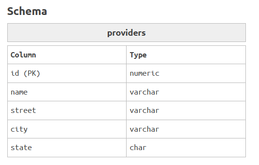
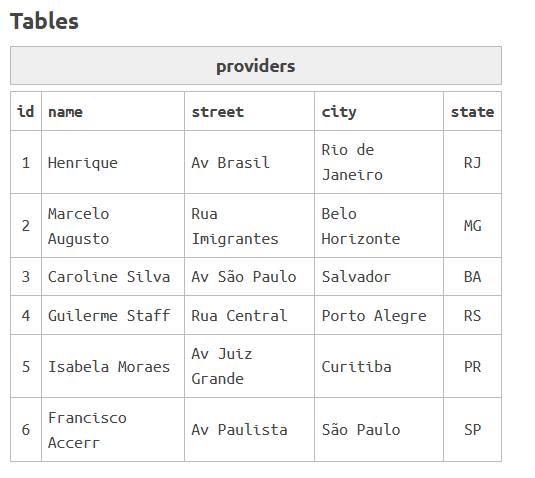
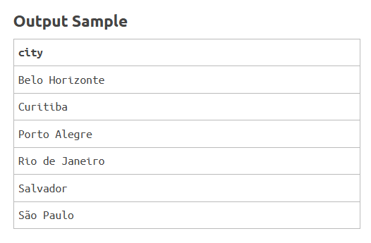

**Solución:**
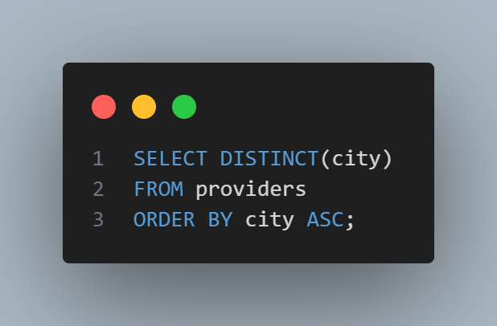

**Explicación:**
* *Recupera los valores de la columna city de la tabla providers.*
* *DISTINCT elimina los duplicados, es decir, si hay varias filas con la misma ciudad, solo se mostrará una vez.*
* *ORDER BY, Ordena los resultados de la consulta en orden (ASC) ascendente (A-Z) según el nombre de la ciudad.*

---


### 3. HIGHER AND LOWER PRICE (Precios más altos y más bajos)
El sector financiero de nuestra empresa desea conocer los precios más altos y más bajos de los productos que vendemos.
Para ello, debe mostrar únicamente los precios más altos y más bajos de la tabla de productos.


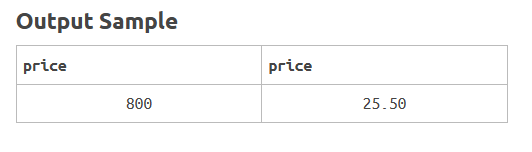

**Solución:**
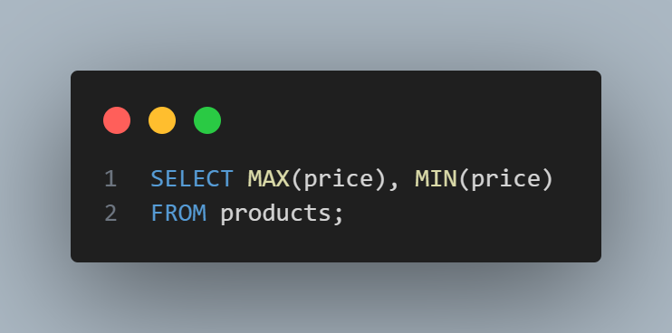

**Explicación:** 
* *MAX y MIN, obtienen el precio más alto y más bajo(price) de la tabla products.*

---


### 4. EXPANDING THE BUSINESS (Expansión del Negocio)
La empresa de videoclub tiene como objetivo crear varias franquicias en todo Brasil. Para ello, necesitamos saber en qué ciudades viven nuestros clientes.
Para que nos ayude a seleccionar el nombre de todas las ciudades donde la empresa de alquiler tiene clientes. Por favor, no repita el nombre de la ciudad.

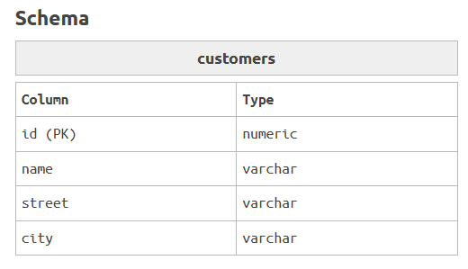
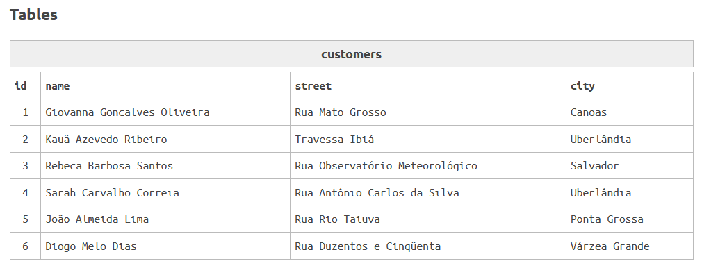
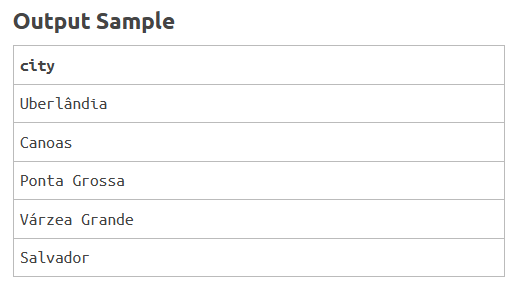

**Solución:**
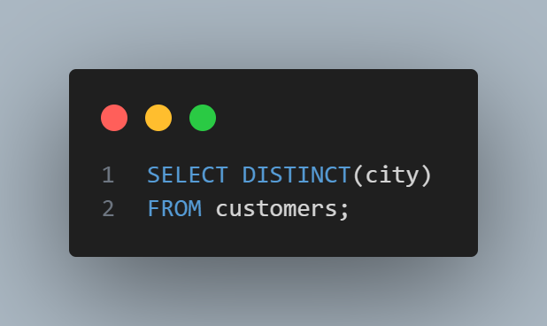

**Explicación:**
* *Selecciona las ciudades solo una vez de la tabla customers.*
---


### 5. PROVIDER AJAX SA (Proveedor Ajax SA)
El sector financiero ha tenido problemas con la entrega de uno de nuestros proveedores. La entrega de los productos no coincide con la factura.
Su tarea es mostrar el nombre de los productos y el nombre del proveedor de los productos suministrados por **"Ajax SA"**.

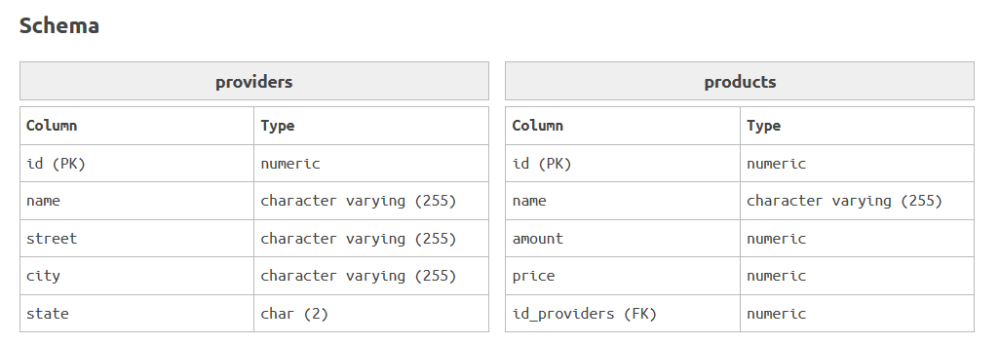
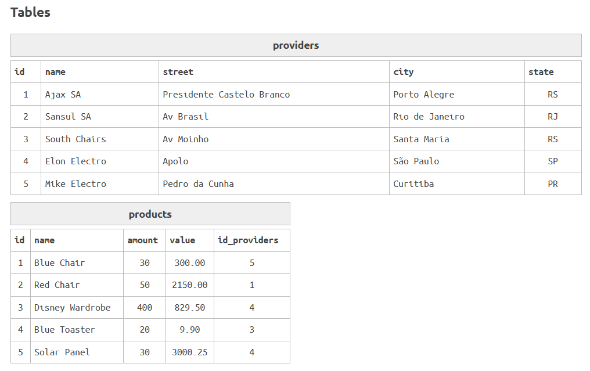
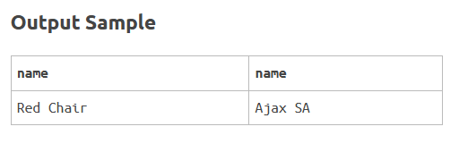

**Solución:**
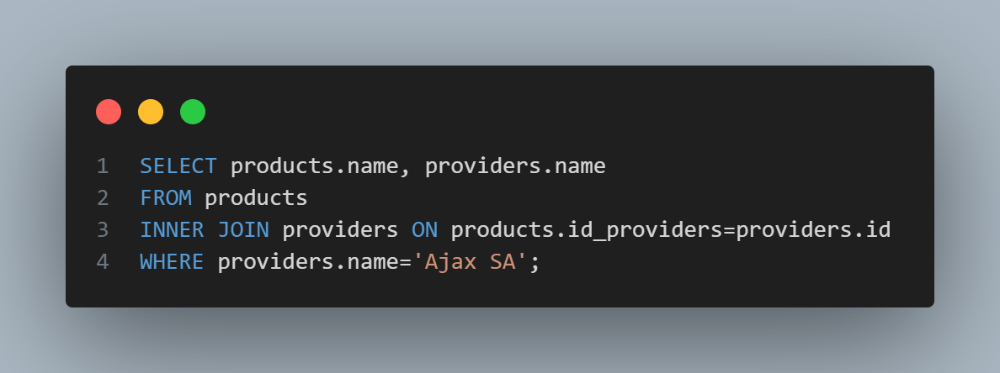

**Explicación:**
```sql
SELECT products.name, providers.name
FROM products
```
* *Selecciona los nombres de los productos y los nombres de los proveedores, de la tabla productos*
```sql
INNER JOIN providers ON products.id_providers=providers.id
```
* *Une la tabla products con la tabla providers mediante la clave foránea id_providers en products y la clave primaria id en providers.*
```sql
WHERE providers.name='Ajax SA';
```
* *Filtra los resultados para que solo se muestren los productos cuyos proveedores tengan el nombre 'Ajax SA'.*

---


### 6. LEGAL PERSON (Persona Jurídica) 
El sector de ventas desea realizar una promoción para todos los clientes que sean personas jurídicas. Para ello, debe mostrar el nombre de los clientes que sean personas jurídicas.

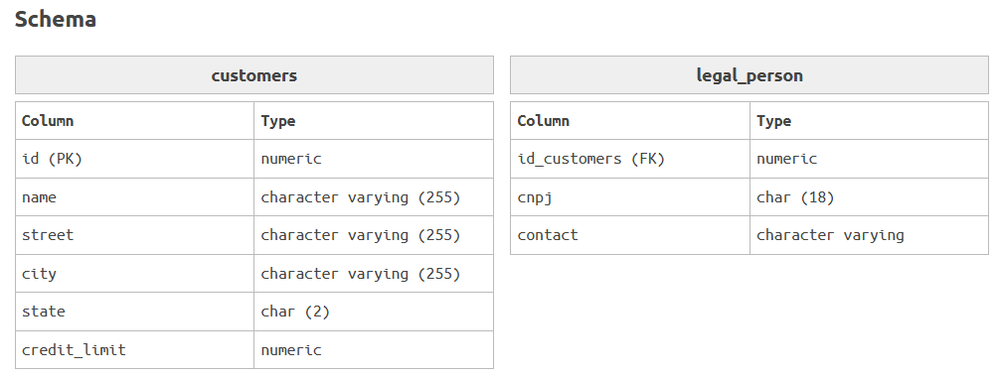
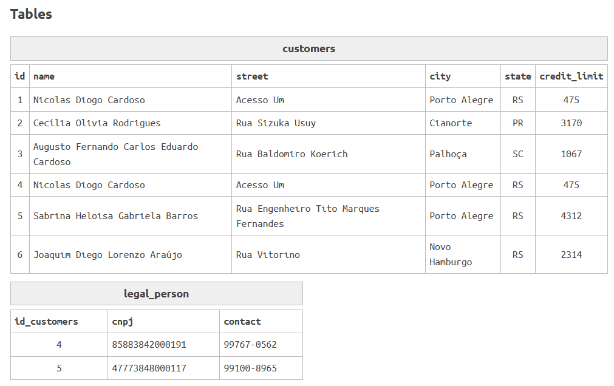
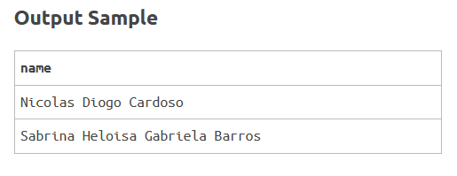

**Solución:**
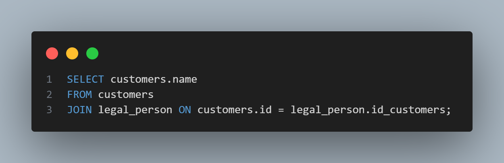

**Explicación:**
```sql
SELECT customers.name
FROM customers
```
* *Se selecciona la columna name de la tabla customers.*

```sql
JOIN legal_person
```
* *En este caso, se está combinando la tabla customers con la tabla legal_person.*
```sql
ON customers.id = legal_person.id_customers
```
* *Aquí se compara la columna id de la tabla customers para que coincida con la columna id_customers de la tabla legal_person.*

---


### 7. PASSWORDS (Contraseñas)
Te contrataron como consultor para una empresa. Al analizar la base de datos, observaste que las contraseñas se almacenan como archivos de texto y, como todos saben, esto es una práctica de seguridad pésima, ya que no están cifradas.
Por lo tanto, debes convertir todas las contraseñas al formato MD5. Muestra el ID del cliente, la contraseña antes de la conversión y el nuevo MD5.

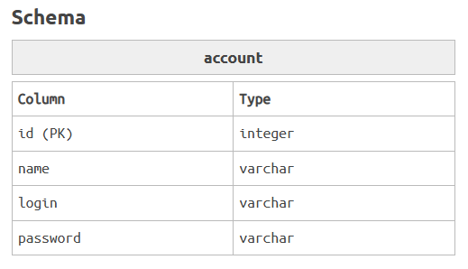
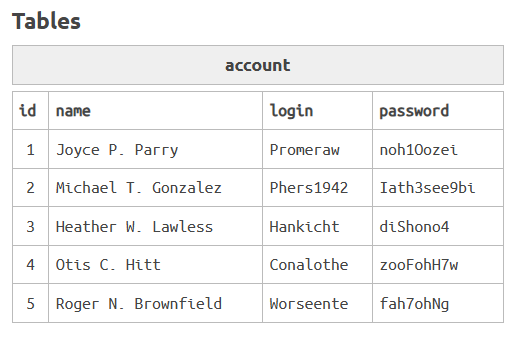
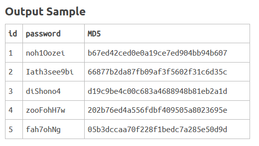

**Solución:**
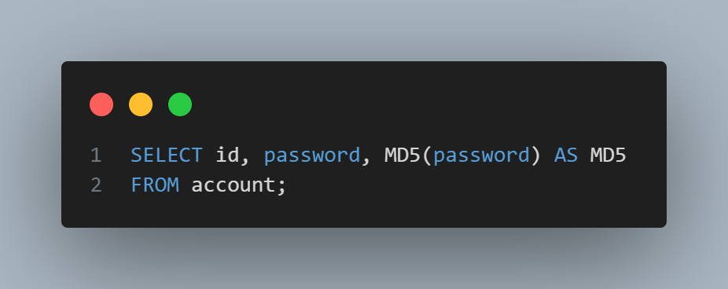

**Explicación:**
```sql
SELECT id, password, MD5(password) AS MD5
```
* *Se selecciona el id y el password directamente desde la tabla.*
* *MD5(password) genera el hash MD5 de la contraseña.*
* *Se usa AS MD5 para nombrar la columna resultante como "MD5".*
```sql
FROM account
```
* *Se extraen los datos de la tabla account.*

---


### 8. VIRUSES (Virus)
Los virus están evolucionando, pero nuevas investigaciones han demostrado que al cambiar algunas proteínas, la vacuna se vuelve invencible. La proteína H1 (hemaglutinina), al ser reemplazada por la proteína X (xenomorfina), tiene efectos interesantes contra casi todas las enfermedades virales. Algunos conspiranoicos afirman que, tras el descubrimiento de la vacuna, se encontraron extrañas criaturas de 3 metros de altura en los alrededores de los laboratorios, pero esto es claramente falso.
Por lo tanto, se debe reemplazar cada cadena "H1" (hemaglutinina) por "X" (xenomorfina).

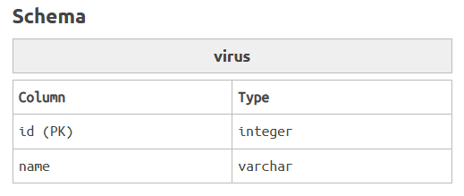
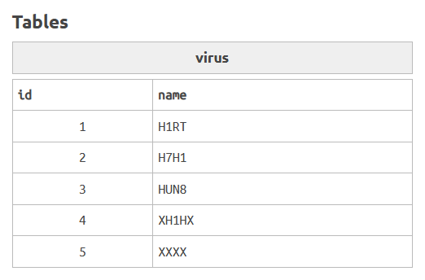
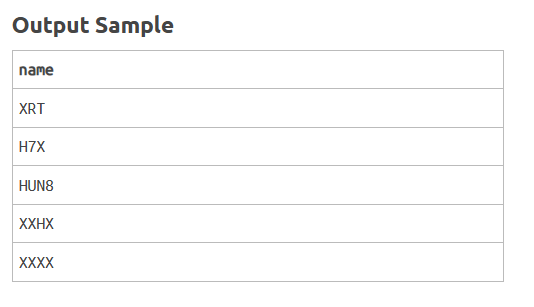

**Solución:**
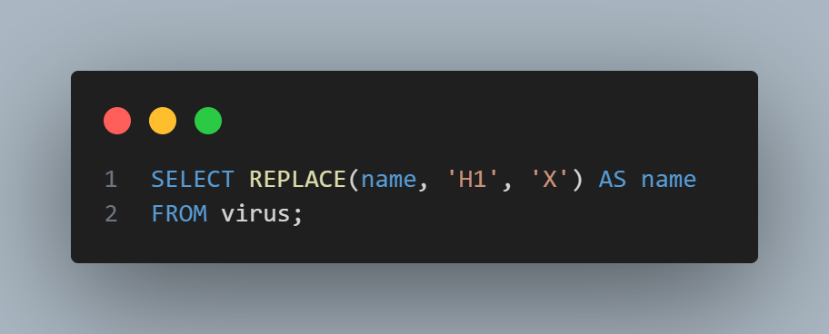

**Explicación:**
* *Busca "H1" dentro del campo name y lo cambia por "X"*
* *AS name, Cambia el nombre de la columna en la salida.*

---

---
## Nivel 2:
---

### 9. UNDER 10 OR GREATER THAN 100 (Menos de 10 o más de 100)
El sector financiero de la empresa necesita un informe que muestre el ID y el nombre de los productos cuyo precio sea menor a 10 o mayor a 100.

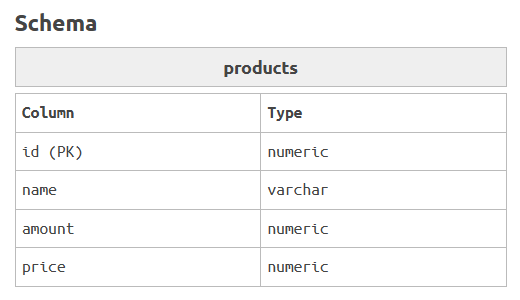
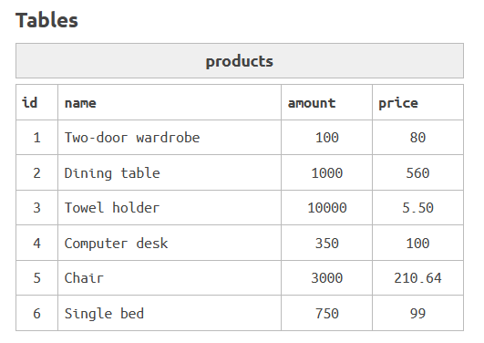
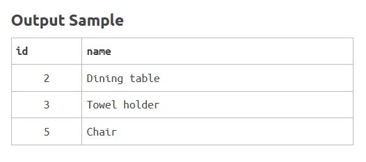

**Solución:**
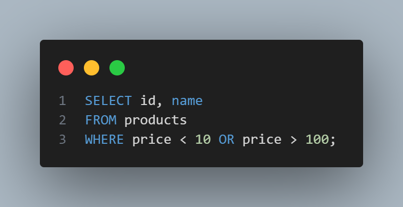

**Explicación:**
* *Se selecciona el id y el name de la tabla products*

```sql
WHERE price < 10 OR price > 100;
```
* *Filtra productos cuyo price sea menor a 10 o mayor a 100*

---


### 10. CHEAP MOVIES (Películas baratas)
En el pasado, el estudio organizó un evento con varias películas en oferta. Queremos saber cuáles eran.
Tu tarea para ayudarnos a seleccionar el ID y el nombre de las películas con un precio inferior a 2.00.

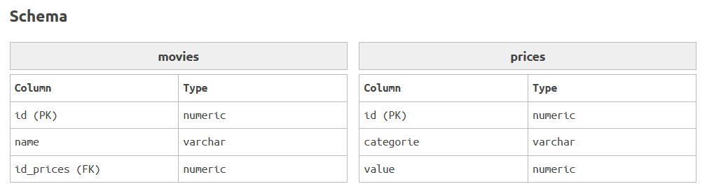
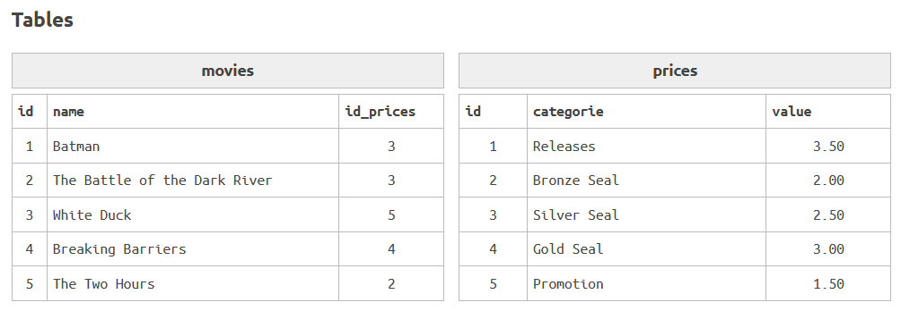
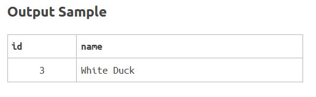

**Solución:**
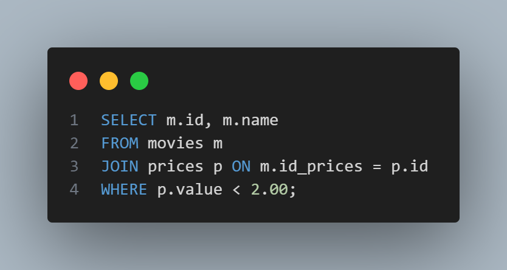

**Explicación:**
```sql
SELECT m.id, m.name
FROM movies m
```
* *Se seleccionan las columnas id y el name de la tabla movies y se le da un alias m para una consulta más clara*

```sql
JOIN prices p ON m.id_prices = p.id
```
* *JOIN une movies con prices.
* *m.id_prices en movies se compara con p.id en prices.*
* *p es el alias de prices*
  
```sql
WHERE p.value < 2.00;
```
* *Se filtra los precios menores a 2.00*

---


### 11. SUPER LUXURY (Superlujo)
Nuestra empresa busca firmar un nuevo contrato para el suministro de nuevos productos de superlujo, y para ello necesitamos información sobre nuestros productos.
Su tarea consiste en mostrar el nombre de los productos, el nombre de los proveedores y el precio de los productos cuyo precio sea superior a 1000 y su categoría sea "Superlujo".

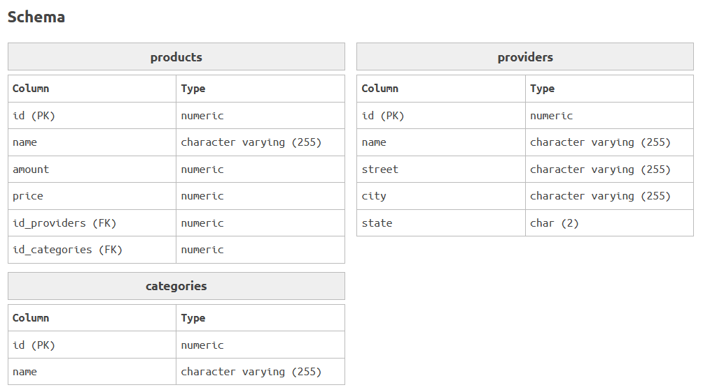
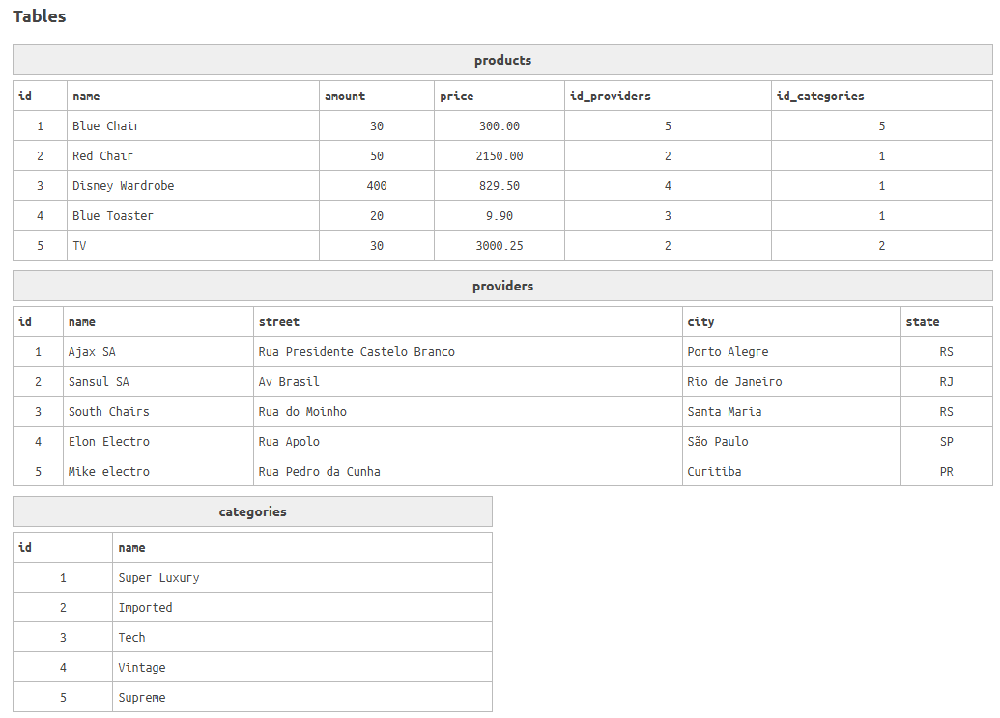
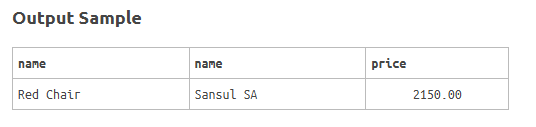

**Solución:**
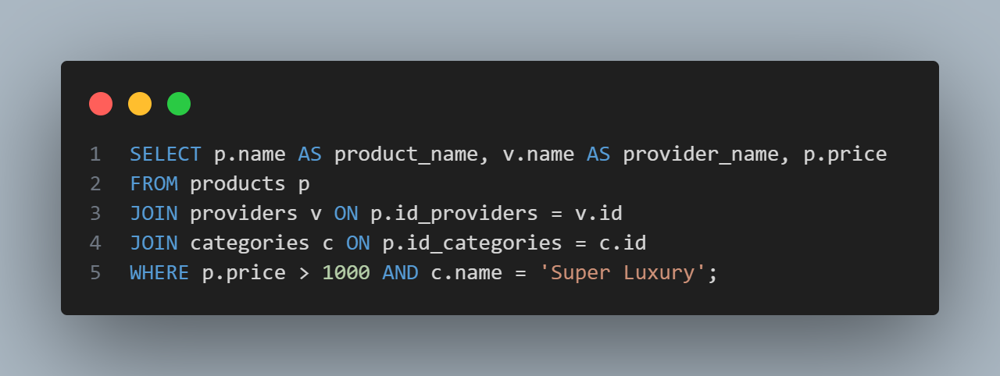

**Explicación:**
```sql
SELECT p.name AS product_name, v.name AS provider_name, p.price 
FROM products p
```
* *p.name AS product_name → Selecciona el nombre del producto y lo renombra como product_name.*
* *v.name AS provider_name → Selecciona el nombre del proveedor y lo renombra como provider_name.*
* *p.price → Muestra el precio del producto.*
* *products es la tabla base, y p es su alias.*
  
```sql
JOIN providers v ON p.id_providers = v.id
```
* *Se une products con providers porque products.id_providers hace referencia a providers.id.*
* *v es el alias para providers.*

```sql
JOIN categories c ON p.id_categories = c.id
```
* *Se une products con categories porque products.id_categories hace referencia a categories.id.*
* *c es el alias para categories.*

```sql
WHERE p.price > 1000 AND c.name = 'Super Luxury';
```
* *Filtra solo los productos con precio mayor a 1000 y que pertenecen a la categoría "Super Luxury".*

---


### 12. HOW MUCH EARN A DOCTOR? (¿Cuánto gana un médico?)
Trabajas en el sector de TI en un hospital y necesitas calcular los ingresos por pagos de cada médico. Cada médico gana 150 $ por hora más un porcentaje que depende del turno de trabajo. Por ejemplo, el doctor Wellington trabajó 1 hora en el turno diurno y 2 horas en el nocturno; por lo tanto, su salario semanal será: ((1 * 150) + 1%) + ((2 * 150) + 15%) = 496,5. Además, puedes usar la función ROUND(valor,1) para mostrar el salario con 1 decimal y ordenar el resultado de mayor a menor.
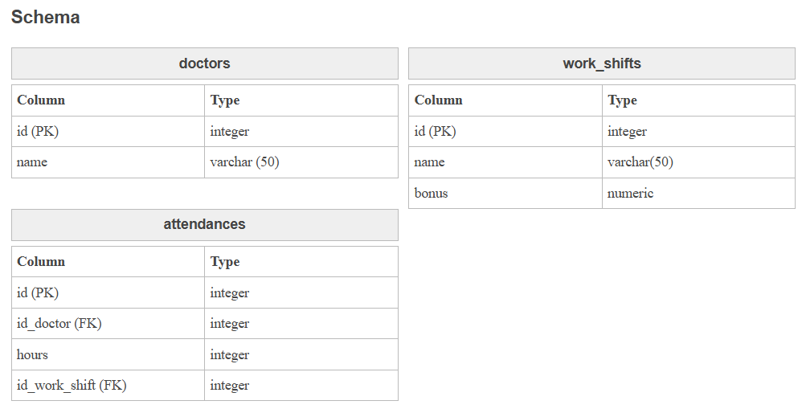
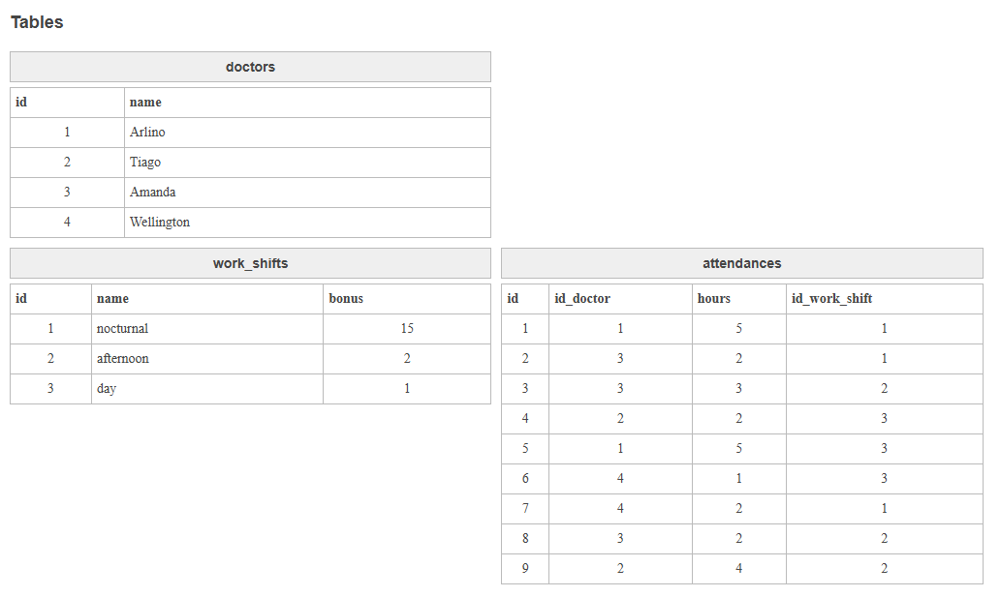
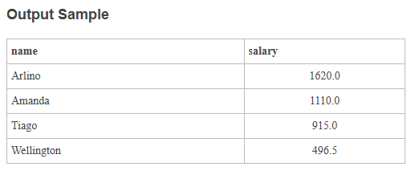

**Solución:**
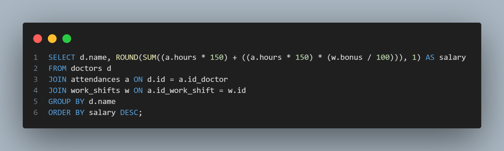

**Explicación:**
```sql
SELECT d.name, ROUND(SUM((a.hours * 150) + ((a.hours * 150) * (w.bonus / 100))), 1) AS salary
FROM doctors d
```
* *Selecciona el nombre del doctor de la tabla doctors.*
* SUM() → Suma el salario de todas las asistencias de cada doctor.
* *a.hours * 150 → Pago base (cada hora vale $150).*
* *(a.hours * 150) * (w.bonus / 100) → Calcula el bono como un porcentaje sobre el pago base.*
* *ROUND(value,1) → Muestra el salario con 1 decimal.*

```sql
JOIN attendances a ON d.id = a.id_doctor
```
* *Se está uniendo la tabla attendances (con el alias a) a la tabla doctors, mediante la condición d.id = a.id_doctor. Esto significa que se está buscando una relación entre el id de la tabla de doctores (d.id) y el id_doctor en la tabla de asistencias (a.id_doctor).

```sql
JOIN work_shifts w ON a.id_work_shift = w.id
```
* *Se está uniendo la tabla work_shifts (con el alias w) a la tabla attendances, mediante la condición a.id_work_shift = w.id. Esto indica que se está relacionando el id_work_shift de la tabla attendances con el id de la tabla work_shifts.*

```sql
GROUP BY d.name
```
* *Agrupa los resultados de la consulta por el nombre del doctor*

```sql
ORDER BY salary DESC;
```
* *Ordena el salario de mayor a menor*


### 13. SILLAS ADYACENTES
Encuentra las sillas adyacentes y disponibles en cada fila del salón de clases. La primera columna del resultado debe contener el identificador de fila, la segunda columna el número de la silla de la izquierda y la tercera el número de la silla de la derecha. El resultado debe ordenarse por el valor de la segunda columna del resultado (left).
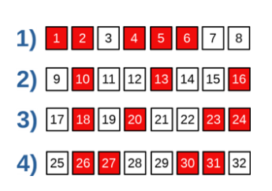
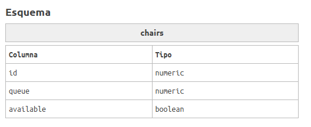
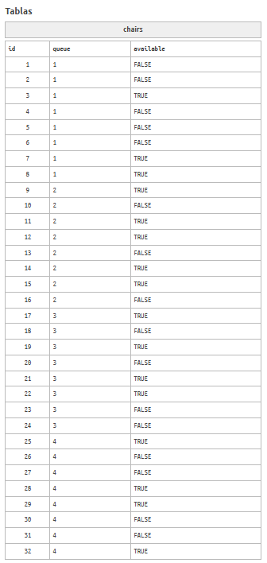
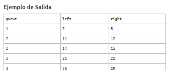

**Solución:**
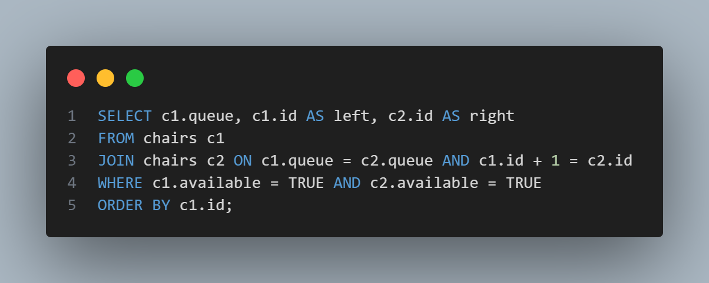

**Explicación:**
```sql
SELECT c1.queue, c1.id AS left, c2.id AS right
```
* *c1.queue: Selecciona el número de la fila de la silla.*
* *c1.id AS left: Selecciona el identificador de la silla en la tabla c1 ("left"). Esta es la silla que estará en el lado izquierdo del par de sillas adyacentes.*
* *c2.id AS right: Selecciona el identificador de la silla en la tabla c2 ("right"). Esta es la silla adyacente que estará en el lado derecho del par de sillas.*
  
```sql
FROM chairs c1
```
* *Se seleccionan los datos de la tabla chairs y se la nombra como c1.*

```sql
JOIN chairs c2 ON c1.queue = c2.queue AND c1.id + 1 = c2.id:
```

* *JOIN chairs c2: Realiza una unión de la tabla chairs consigo misma.*
* *ON c1.queue = c2.queue: La condición para hacer la unión es que las dos sillas deben pertenecer a la misma fila.*
* *AND c1.id + 1 = c2.id: Esta condición asegura que estamos emparejando sillas adyacentes.*

```sql
WHERE c1.available = TRUE AND c2.available = TRUE:
```
* *Filtra las filas para asegurarse de que ambas sillas estén disponibles.*
* *c1.available = TRUE, Asegura que la silla de la izquierda (c1) esté disponible.*
* *c2.available = TRUE, Asegura que la silla de la derecha (c2) también esté disponible.*

```sql
ORDER BY c1.id
```
* *Ordena el resultado final por el identificador de la silla de la izquierda (c1.id).*

---

### 14. CLASIFICACIÓN DE UN ÁRBOL
Dado el siguiente árbol binario equilibrado almacenado en la tabla nodes, clasifique cada nodo con los tipos LEAF, INNER y ROOT. Presentar el resultado ordenado por el valor del identificador del nodo.
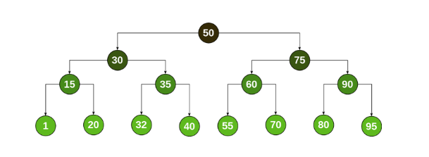
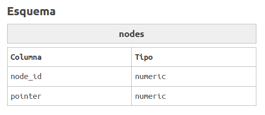
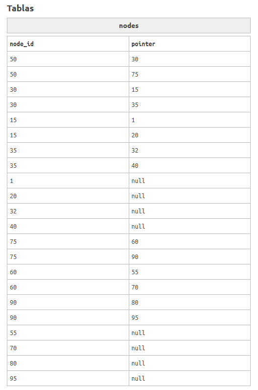
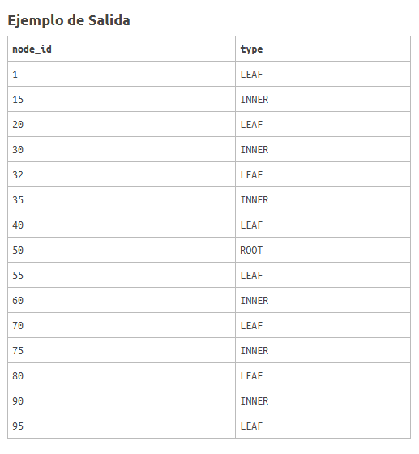

**Solución:**
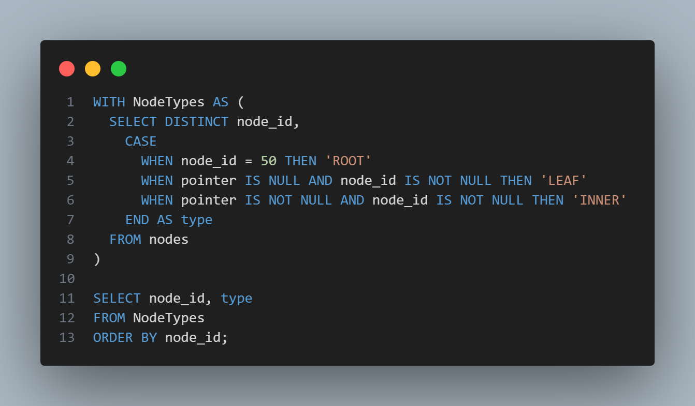

**Explicación:** 
```sql
SELECT DISTINCT node_id,
  ```
* *Se asegura de que no haya nodos repetidos.*
  
```sql
WHEN node_id = 50 THEN 'ROOT'
```
* *Considera que el nodo con node_id = 50 es la raíz del árbol.*
  
```sql
WHEN pointer IS NULL AND node_id IS NOT NULL THEN 'LEAF'
```
* *Si un nodo no apunta a otro (pointer IS NULL), es una hoja.*
  
```sql
WHEN pointer IS NOT NULL AND node_id IS NOT NULL THEN 'INNER'
```
* *Si un nodo apunta a otro (pointer IS NOT NULL), es un nodo interno.*
  
```sql
SELECT node_id, type
FROM NodeTypes
ORDER BY node_id;
```
* *Extrae los nodos con su clasificación (type).*
* *Ordena los nodos por node_id.*

---

### 15. SEGUIDORES
En una red social con varios usuarios que comparten información, es común que un usuario siga a otros. Determina qué usuarios se siguen entre sí, por ejemplo Francisco sigue a Laura y Laura sigue a Francisco. El resultado debe contener dos columnas con los nombres de los dos usuarios que se suceden. La primera columna debe contener el nombre del usuario con menor número de publicaciones y la segunda con mayor cantidad de publicaciones, por ejemplo entre Francisco y Laura, Francisco tiene 23 publicaciones y Laura 55, por lo que Francisco aparece en la primera columna y Laura en la segunda columna. Además, debes ordenar el resultado por la identificación del usuario en la primera columna.
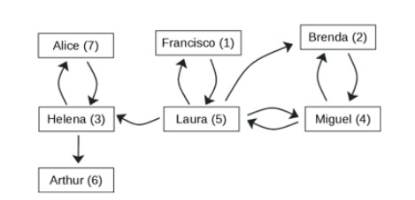
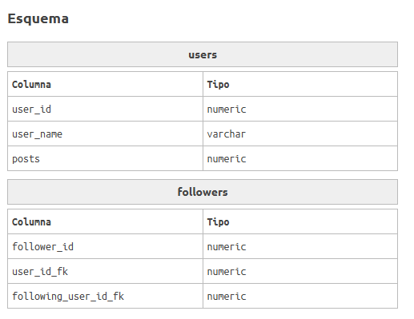
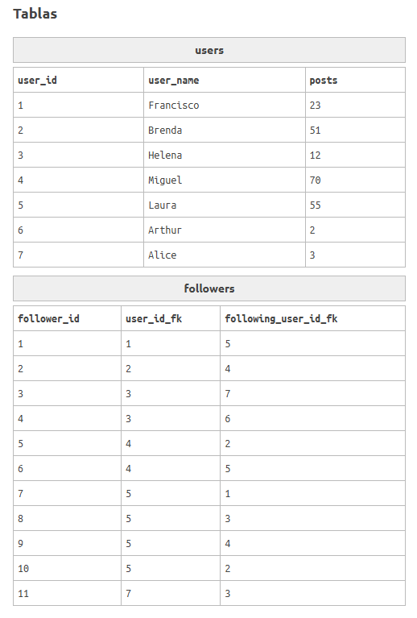
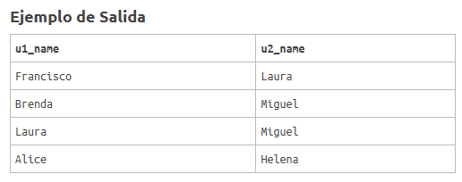

**Solución:**
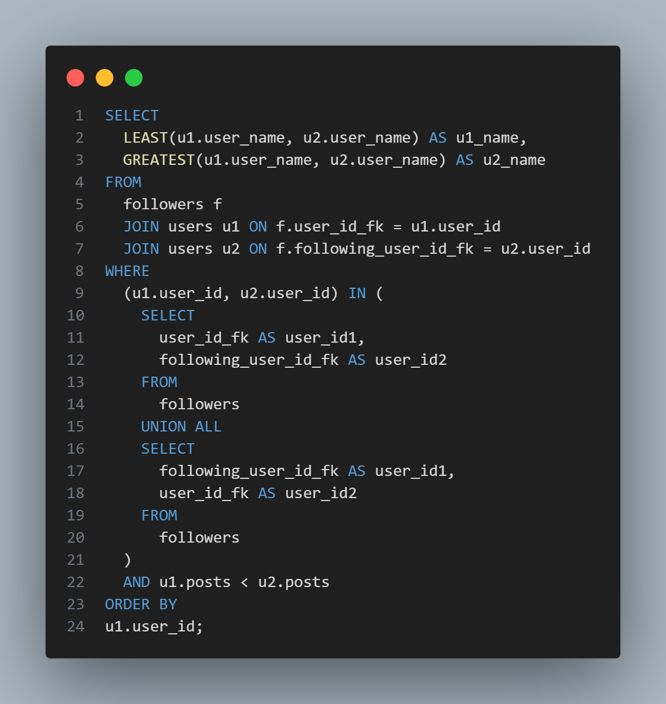

**Explicación:** 
```sql
FROM
  followers f
  JOIN users u1 ON f.user_id_fk = u1.user_id
  JOIN users u2 ON f.following_user_id_fk = u2.user_id
```
* *followers es la tabla que almacena las relaciones de seguimiento entre los usuarios.*
* *Se usa JOIN para unir la tabla followers con la tabla users dos veces:*
* *u1 representa al usuario que sigue a otro (user_id_fk).*
* *u2 representa al usuario que es seguido (following_user_id_fk).*

```sql
WHERE
  (u1.user_id, u2.user_id) IN (
    SELECT
      user_id_fk AS user_id1,
      following_user_id_fk AS user_id2
    FROM
      followers 
    UNION ALL
    SELECT
      following_user_id_fk AS user_id1,
      user_id_fk AS user_id2
    FROM
      followers
  )
```

* *Se usa una subconsulta que genera todas las combinaciones de seguidores y seguidos en ambas direcciones (UNION ALL evita eliminar duplicados):*
* *La primera consulta (SELECT user_id_fk, following_user_id_fk FROM followers) obtiene relaciones directas de seguimiento.*
* *La segunda consulta (SELECT following_user_id_fk, user_id_fk FROM followers) invierte la relación para detectar el seguimiento mutuo.*

```sql
SELECT
  LEAST(u1.user_name, u2.user_name) AS u1_name,
  GREATEST(u1.user_name, u2.user_name) AS u2_name
```
* *LEAST(u1.user_name, u2.user_name): Selecciona el nombre alfabéticamente menor y lo pone en la primera columna (u1_name).*
* *GREATEST(u1.user_name, u2.user_name): Selecciona el nombre alfabéticamente mayor y lo pone en la segunda columna (u2_name).*

```sql
AND u1.posts < u2.posts
```
* *Se asegura de que el usuario con menor cantidad de publicaciones (posts) aparezca en la primera columna (u1_name).*

```sql
ORDER BY 
u1.user_id;
```

* *Ordena los resultados por el user_id del usuario con menos publicaciones.*

---

### 16. SEGUNDO MAYOR Y MENOR
Encuentre la ciudad con la segunda población más grande y luego la ciudad con la segunda población más pequeña.
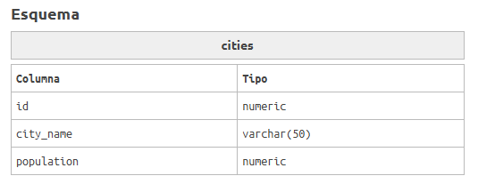
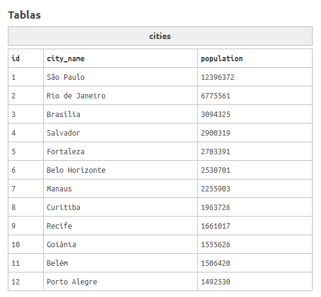
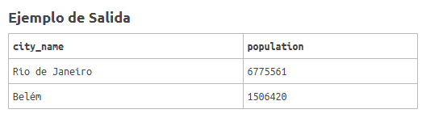

**Solución:**
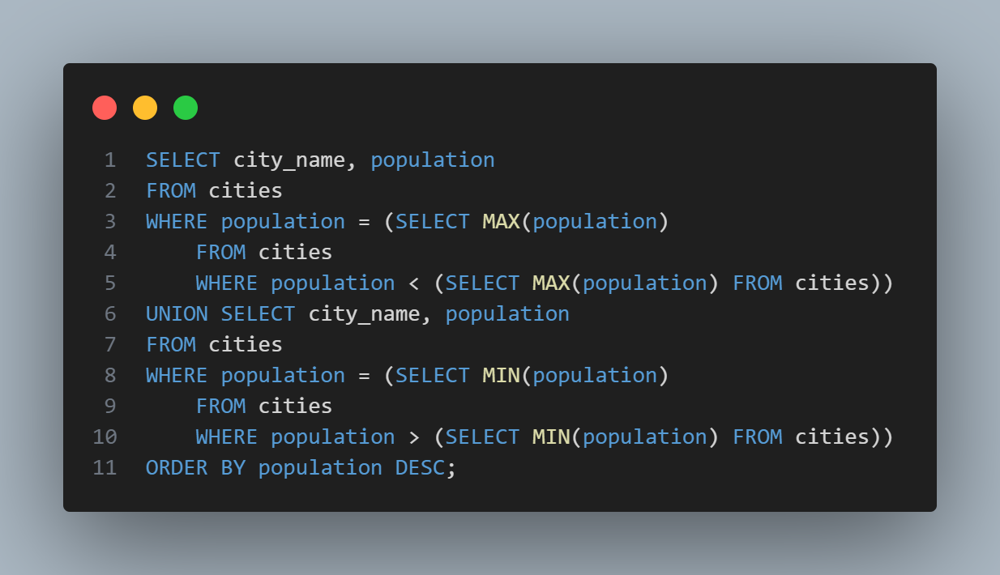

**Explicación:**
```sql
WHERE population = (SELECT MAX(population)
FROM cities
WHERE population < (SELECT MAX(population) FROM cities))
```
* *Esta subconsulta encuentra la ciudad con la segunda población más grande. Primero encuentra la población más grande y luego selecciona el valor máximo de las poblaciones menores que la más grande, es decir, la segunda más grande.*

```sql
WHERE population = (SELECT MIN(population)
    FROM cities
    WHERE population > (SELECT MIN(population) FROM cities))
```
* *Esta subconsulta encuentra la ciudad con la segunda población más pequeña. Primero encuentra la población más pequeña y luego selecciona el valor mínimo de las poblaciones mayores que la más pequeña, es decir, la segunda más pequeña.*

```sql
UNION SELECT city_name, population
FROM cities
```
* *Se usa UNION para combinar los resultados de las dos subconsultas: una que encuentra la ciudad con la segunda población más grande y la otra que encuentra la ciudad con la segunda población más pequeña.*

```sql
ORDER BY population DESC;
```
* *Se ordenan los resultados por la población en orden descendente.*

---